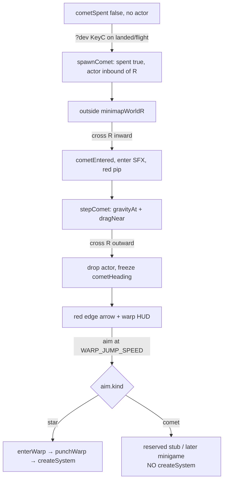
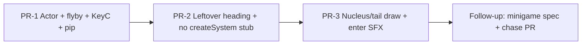

# Comet Visitor: Current-Chart Sighting and Warp Lock

| Field | Value |
|---|---|
| **Author** | Orbit |
| **Date** | 2026-09-17 |
| **Status** | Locked |
| **Scope** | Client-side 2D space-flight (`src/game/*`). Chart-local visitor. No comet persistence, no server sim, no multiplayer comet state. Chase minigame is **not** specified here. |

This document locks the comet as a current-chart visitor, the leftover warp heading, DEV probe `KeyC`, and the branch that must not call `createSystem`. Product decisions in **Key Decisions** are final — do not reopen them in implementation PRs. Spell it **comet**, not commet.

The chase minigame (arrival, camera, landing, debris combat) is explicitly **not** locked. See [Minigame (TBD)](#minigame-tbd) and [Open Questions](#open-questions). The only minigame fact that **is** locked: warping at the comet heading enters a minigame instead of `createSystem`.

Sibling lock: Combustible (Notion). Occupancy lock: `docs/occupancy.md`. Comets are not bodies in that model — do not reopen occupancy.

---

## Overview

Orbit’s warp map is a handful of grey `NearbyHeading`s rolled in `rollNearby` (`src/game/world.ts`) and consumed by `lockedNearby` / `punchWarp` (`src/game/sim.ts`). Everything else on the chart is a `Planet` on a Kepler rail. There is no visitor that crosses the well and leaves a heading behind.

The change is a **new sim actor**, not a `PlanetKind`. A comet flies a fast chord through the current chart — warning sound, red mini-map pip, small nucleus + anti-star ion tail — then leaves a **persistent red warp-lock heading** on the exit bearing, same verbs as a nearby star (mini-map edge arrow + `drawWarpAims` once speed ≥ `WARP_BAR_SPEED`). Aiming at that heading at `WARP_JUMP_SPEED` commits warp. Destination is a comet minigame, **not** a new chart: `punchWarp` must not call `createSystem` for this target.

Until a follow-up spec exists, committing the comet heading is a **reserved stub** that does not generate a random star, does not enter lost-warp, and does not leave the current chart.

---

## Background & Motivation

### Current state

The only **charted body** class is `Planet` (`src/game/types.ts`). `PlanetKind = "star" | "rocky" | "gas" | "moon" | "asteroid" | "barycenter"`. Occupancy (`settlement` / `civ`) is a second pass at the end of `makeSystem`. Kepler rails (`keplerRail`, `stepOrbitingBodies` in `src/game/sim.ts`) move every body that has `parentId` + `orbitR` + `orbitA` + `orbitW`. The star sits at the origin. Ghost barycenters contribute no gravity.

Visitors and effects are already ad-hoc and **not** `Planet`s: `sim.flares`, belt ticks (`scanBeltHull` in `src/game/belt.ts`), ion wisps, warp rings. The ship is the other class of mover. `gravityAt` sums planet wells; `dragNear` (private in `sim.ts`) applies corona / haze / atmo; nothing in the n-body sum is the ship. `collidePlanets` is ship-vs-`Planet` only. A comet belongs with those ad-hoc actors, not in `PlanetKind`.

Warp is a heading cone, not a map pick:

- `WARP_BAR_SPEED = 1000` — charge bar and `drawWarpAims` appear (`src/game/world.ts`).
- `WARP_JUMP_SPEED = 1500` — `stepSim` calls `lockedNearby(dir, sim.nearby, WARP_AIM_DEG)` (`WARP_AIM_DEG = 0.5`).
- Hit → `sim.warpTarget = aim; enterWarp(sim)`. Miss → `enterWarp(sim, true)` (lost).
- `enterWarp` drops into `phase: "transit"`. `punchWarp` (at `transitPunchAt`) is the chart swap: `createSystem(undefined, {}, sim.warpTarget?.pal ?? null, sim.warpTarget?.name ?? null)`, then `pickWarpArrival`.

Nearby stars are grey mini-map edge arrows (`drawMinimapNearby` / `drawMinimapEdgeArrow`, `rgba(140, 142, 148, 0.88)`). `scatterHeadings` keeps them ≥ **52°** apart so the 0.5° cone cannot steal two at once.

Flares already own “dangerous thing next to the star.” `spawnFlare` long reach is `star.radius * (3.05 + rng * 0.95)` — max **4.0 ×** star radius. Star corona / drag outer radius is `STAR_ATMO_FACTOR = 2.1`. `shipHitsFlare` + `collidePlanets` on the star disk are instant burn (`crashKind: "burn"`). `LAND_SPEED = 30` and `vn < 20` are the land-vs-wreck law in `collidePlanets`.

`KeyC` is not in `GAME_CODES` (`src/game/input.ts`). `?dev` already gates E / T / P via `devToolsFromSearch` in `src/game/runtime.ts`. Overlay KeyTips for those probes show only when `hud.dev`.

`audio.warn()` is the orbit-lost chirp, fired from `runtime.ts` when `sim.orbitDragAlarm` is set. Do not reuse it.

### Pain points

1. **No visitor class.** Adding a comet as `PlanetKind` would drag occupancy, Kepler rails, `gravityAt` sources, spectro, title-list kickers, and `padHasFuel` into a flyby that is none of those things.
2. **Warp has only stars.** `punchWarp` always charts a new well. A leftover comet heading would silently become a random star if `kind` is not discriminated.
3. **Flares occupy the star’s skirt.** A periapsis inside long-flare reach reads as a second flare, not a sighting.
4. **DEV has no probe.** Camps needed `?camp` because the natural roll is rare. Comets need `KeyC` the same way E/T/P work under `?dev`.

### What this is not

This is not occupancy. Comets are not occupiable surfaces, not in `makeSystem`, not in `assignOccupancy`. Do not add `settlement` / `civ` / `matter` / `kicker` to the comet.

This is not the chase minigame. Arrival brake, chase camera, landing-as-oasis, spectro-on-comet, and trail-combat numbers are [TBD](#minigame-tbd).

Charting stays local and procedural. `createSystem` still builds an in-memory `ChartedSystem`. A comet is **sim-time** on that chart, discarded with the sim on warp (star destination) or KeyN. There is no comet column, no save blob, no server authority. Auth / PGLite are unrelated. Do not invent migrations or a feature-flag service.

---

## Goals & Non-Goals

### Goals (current-chart + warp-lock)

- Add a `Comet` sim actor that is not a `Planet`. No occupancy, no mix, no Kepler rail, not a source in `gravityAt`.
- Integrate it ship-like: it **feels** `gravityAt` and `dragNear`; nothing feels it back.
- Uncatchable in the current chart: too fast to intercept before exit; nucleus is not a `collidePlanets` target here. The ship must use warp to catch it (minigame).
- Path: enter from one side of `getMinimapWorldR()`, periapsis close to the star but outside stellar burn / flare kill volume, leave the opposite side. Mini-map crossing on the order of **15–25 s**.
- Mini-map: warning sound on enter, then a fast **red** pip while inside the chart.
- After exit: persistent red edge arrow + warp-HUD mark, `kind: "comet"`, angular separation from star headings comparable to `scatterHeadings` (~52°).
- Warp commit on that heading does **not** call `createSystem`. Stub until the minigame spec: reserved no-op, current chart preserved.
- `?dev` + `KeyC` one-shot per chart (`cometSpent`). Warp / KeyN restock; reboot-to-pad does not. KeyTip `[C]omet` only while `?dev` and the shot remains.
- New enter one-shot SFX. Do not call `audio.warn()`.
- Reduced motion: skip tail / streak animation; keep pip, leftover arrow, and warning sound.
- Tests in `src/game/comet.test.ts` (and warp-lock cases) added to the explicit `package.json` `test` file list.

### Non-goals (explicitly later)

- **Chase minigame mechanics** — arrival pose, relative brake, chase camera, star streaks at matched warp speed, debris field, landing-as-oasis vs one-way, spectro-on-comet, takeoff-from-comet. See [Minigame (TBD)](#minigame-tbd).
- **Natural spawn in the first PRs.** First implementation is C-only. Rarity later is “this chart may get one visitor,” not a timer that can fire twice. Shared `cometSpent`.
- Making the comet a `PlanetKind`, or folding it into occupancy / matter / kickers.
- Putting the comet in n-body as a gravity source, or on `keplerRail` / `stepOrbitingBodies`.
- Catching, landing on, or wrecking against the nucleus **in the current chart**.
- Trail hull-damage numbers in the flyby PRs (`scanBeltHull` is the pattern to reuse in the minigame).
- Persistence, server, multiplayer comet state.
- Reusing `audio.warn()`, or playing the enter sting when C is pressed off-screen.
- A feature-flag service. Rollback is git revert.
- Reopening `docs/occupancy.md`.

---

## Key Decisions

1. **Comet is a new sim actor, not a `Planet` / `PlanetKind`.** Occupancy, Kepler rails, spectro, title-list kickers, and `padHasFuel` all assume `Planet`. A visitor that is not a surface does not belong in that bag. Dedicated type in `src/game/types.ts` (or `src/game/comet.ts` re-exported), stepped from `Sim`, drawn as its own pass.

2. **Ship-like physics, not n-body.** The comet **feels** `gravityAt(x, y, sim.planets, gravityScale)` and `dragNear(...)` exactly as the ship does in `stepSim`. It is **not** passed into `gravityAt` as a source. Planets, the ship, and belt motes do not feel it. No `orbitR` / `orbitA` / `orbitW` — `stepOrbitingBodies` never sees it.

3. **Uncatchable in the current chart.** Crossing is 2 × `getMinimapWorldR()` / 15–25 s (~864–1440 u/s on a 10800 chart; `WARP_JUMP_SPEED = 1500`). The nucleus is **not** a `collidePlanets` target on this chart: no land, no wreck, no burn-from-comet. Sighting only. Catching is warp → minigame.

4. **Periapsis is a sighting, not a second flare.** Closest approach to the star stays outside the stellar kill volume: corona `STAR_ATMO_FACTOR = 2.1` and long-flare max reach `4.0 × star.radius` (`spawnFlare` in `sim.ts`). One locked floor, used by spawn **and** tests: nucleus-center to star-center ≥ `COMET_PERI_CLEAR = 4.2 * star.radius + COMET_NUCLEUS_R`. Spawn impact parameter `b` **is** that quantity (sign random). Path still reads “next to the star” on the mini-map.

5. **Ion tail is anti-star, not anti-velocity.** Real ion tails point away from the sun. Dust / debris lag the path (wake), reusing the *idea* of `emitIonTrail` (ion drag) and belt hull ticks (grit behind relative motion). Direction is locked; particle counts are PR-3 tuning, not product.

6. **Leftover heading is a warp-lock token, same verbs as a nearby star.** After the nucleus exits `getMinimapWorldR()`, freeze `NearbyHeading.kind = "comet"` on the exit bearing. Mini-map: `drawMinimapEdgeArrow` in red (not grey `rgba(140, 142, 148, 0.88)`). Warp HUD: `drawWarpAims` once speed ≥ `WARP_BAR_SPEED` or `status === "warp"`. It stays for the rest of this chart, including reboot-to-pad.

7. **`kind` discrimination on headings, not a parallel cone.** Extend `NearbyHeading` with `kind: "star" | "comet"`. `rollNearby` writes `"star"`. A helper `warpHeadings(nearby, cometHeading)` concatenates `sim.nearby` with optional `sim.cometHeading` (no `Sim` import in `comet.ts`). `lockedNearby` stays generic. `punchWarp` / the jump site branch on `aim.kind === "comet"`. Do not dump the comet into `ChartedSystem.nearby` as a fake star.

8. **Angular separation ~52° from star headings.** Export `HEADING_MIN_SEP = (52 * Math.PI) / 180` and `angDiff` from `src/game/world.ts` (today they are private next to `scatterHeadings`). `separateCometHeading(trueAngle, nearby)`: if `trueAngle` is ≥ min-sep from every **star** heading, keep it; else scan both directions and take the smaller `|Δ|` that is legal (tie → positive sense). Rotate the **token**, not the physical path. The 0.5° `WARP_AIM_DEG` cone must not steal a star or be stolen by one. Test fixture: true exit equal to a star heading still yields a legal token.

9. **Warp at the comet heading does not `createSystem`.** Locked branch point: the `WARP_JUMP_SPEED` commit in `stepSim` (the `lockedNearby` / `enterWarp` block). `enterWarp` / `punchWarp` must not chart a new well for `kind: "comet"`. Until the minigame spec, the stub **refuses the jump in the current chart**: no transit tunnel, no `enterWarp(sim, true)` lost path, no `pickWarpArrival`. Dump speed below `WARP_JUMP_SPEED` so the check does not re-fire every frame. `orbitHint` may say the path is reserved.

10. **`KeyC` is the required DEV probe; one shot per chart.** `GAME_CODES` gains `"KeyC"`. Drain the latch like E / T / P: `consumeComet() && devTools` (not `devTools && consumeComet()`), then `trySpawnComet(sim)` from **`sim.ts`**. Fire from `phase === "landed" | "flight"` only. Ignore title, transit, crashed **without spending**. `cometSpent` is set when a spawn actually fires (C or, later, natural). `rebootSim` does **not** clear `cometSpent` / `cometHeading` / a live comet. Star `punchWarp` (copies a new `ChartedSystem` onto the live `Sim`) and `createSim` (new chart / KeyN) **do**. Do not hang that reset on `clearFlightLocks` / `enterWarp`.

11. **Enter SFX is a new one-shot on chart entry, not on the key.** Do not call `audio.warn()`. If C is pressed such that the nucleus is still outside `getMinimapWorldR()`, wait until it crosses in. Reduced motion still plays the sting.

12. **Natural spawn is deferred; the spent flag is shared.** First PRs are C-only. When natural spawn lands, it is “at most one visitor per chart,” not a repeating timer. C and natural both set `cometSpent`.

13. **Reduced motion skips tail / streak animation only.** Pip, leftover arrow, and warning sound remain. Matches occupancy / flare / mine-beacon reduced-motion policy (`sim.reducedMotion` from `prefers-reduced-motion`).

14. **No cloud rollout, no occupancy reopen.** Client toy. Rollback is git revert. Debug is `?dev` + `KeyC`. Optional `?comet` auto-spawn is allowed later if useful; C remains required. Do not add a `PlanetKind`. Do not touch `docs/occupancy.md` product locks.

15. **Minigame combat is locked as intent only.** Nucleus contact in the *chase* uses the existing land-vs-wreck law (`rel < LAND_SPEED && vn < 20` → land; else wreck). Trail is drag + hull ticks (atmo-drag + `scanBeltHull` patterns), with density falloff so landing is possible. Numbers, camera, and layout are **not** locked. Do not ship fake chase constants in the flyby PRs.

---

## Proposed Design

### Actor model

```ts
export type NearbyHeadingKind = "star" | "comet";

export type NearbyHeading = {
  angle: number;
  color: string;
  pal: [string, string, string];
  name: string;
  kind: NearbyHeadingKind;
};

export type Comet = {
  x: number;
  y: number;
  vx: number;
  vy: number;
  radius: number;
  /** Felt by nothing. Present so a later minigame can land. */
  mass: number;
};
```

`rollNearby` sets `kind: "star"` on every existing heading. Warp-test fixtures that construct `NearbyHeading` literals grow `kind: "star"` — that is the typecheck migration, same idea as occupancy’s required fields.

On `Sim` (`src/game/sim.ts`):

```ts
comet: Comet | null;           // live nucleus while inside (or inbound of) the chart
cometSpent: boolean;           // C or natural already fired this chart
cometHeading: NearbyHeading | null; // leftover warp token after exit
cometEntered: boolean;         // sticky: has crossed inward of R this visit
```

`createSim` initializes all of those empty / false via `resetCometChart(sim)`. `rebootSim` **does not** touch them. Star `punchWarp` (after `createSystem` + `sim.planets = copyPlanets(...)` / `sim.nearby = sys.nearby.slice()`) calls `resetCometChart` — it does **not** go through `createSim`. Do **not** reset from `clearFlightLocks` or `enterWarp` (F-1 must be able to reuse `enterWarp` without wiping the token). `copyPlanets` never sees a comet.

`cometEntered` is sticky `hasEnteredChart`: set on the inward `R` crossing, never on KeyC. Cleared only by `resetCometChart`. Runtime keeps `prevCometEntered` (same pattern as `prevPhase` for `audio.warpJump()`) and fires `audio.cometEnter()` on the false→true edge.

### Module boundary

`dragNear` is **private** in `src/game/sim.ts`. `gravityAt` is exported. Occupancy and belt already avoid a `sim.ts` ↔ helper cycle by taking slices, not `Sim`.

Lock **(b)** plus a closed import graph:

- `src/game/comet.ts` owns spawn geometry (`spawnComet(planets, rng): Comet`), `warpHeadings(nearby, cometHeading)`, `separateCometHeading`, `makeCometHeading(angle)`, periapsis helpers, and **`COMET_RED`**. It imports `types.ts` / `world.ts` only. **Not** `sim.ts`. **Not** `draw.ts`. Do not `import type { Sim }`.
- `src/game/sim.ts` implements and exports `stepComet` (private `dragNear` stays here) and **`trySpawnComet(sim: Sim): boolean`** (phase / spent guards, then `spawnComet`, writes `sim.comet` / `sim.cometSpent` / `sim.cometEntered = false`). Runtime and `__controlsTest.spawnComet` call this.
- `src/game/draw.ts` imports `COMET_RED` (and `warpHeadings`) from `comet.ts` for pip / leftover arrow / HUD.

Do not put `stepComet` or `trySpawnComet` in `comet.ts`. Do not value-import `dragNear` / `gravityAt` / `Sim` from `sim.ts` into `comet.ts`. Do not import `COMET_RED` from `draw.ts` (that is `sim → comet → draw → sim`). Do not duplicate the hex. Do not reimplement drag in `comet.ts`.



### Flyby geometry

Chart radius `R = getMinimapWorldR()` (floor 10800 in `createSystem`; typical charts are that or larger). Chord ≈ `2R`. Target crossing **15–25 s** on the mini-map:

| R | T = 15 s | T = 25 s |
|---|---|---|
| 10800 | ~1440 u/s | ~864 u/s |
| 14000 | ~1867 u/s | ~1120 u/s |

`WARP_JUMP_SPEED = 1500` sits at the fast end of that band. The leftover warp heading is still the catch path; the nucleus is not a collision target on this chart.

Spawn (`spawnComet` in `src/game/comet.ts`):

- Pick inbound bearing `theta` uniformly. Retry `theta` (cap ~12) if the unperturbed chord’s closest approach to a **gas** disk is inside that giant’s radius, so `dragNear` on a cloud deck cannot fake a periapsis dip. If retries exhaust, keep the last `theta` — the star floor still holds.
- Place the nucleus at `(cos theta, sin theta) * R * COMET_SPAWN_OUT` with `COMET_SPAWN_OUT ≈ 1.02` so the first frame is still outside — enter SFX is a real crossing, not the keypress. `cometEntered` stays false until the inward `R` crossing.
- Aim across the origin with impact parameter `b = COMET_PERI_CLEAR = 4.2 * star.radius + COMET_NUCLEUS_R`, sign random. That **is** the periapsis floor, not a guess to iterate in review.
- Speed `v = (2 * R) / T` with `T ∈ [15, 25]`.
- Nucleus radius: `COMET_NUCLEUS_R = 27` (about a small landable asteroid; ship hull is 9). Not sized like a rocky world.

`stepComet` lives in `src/game/sim.ts` (export for tests):

```ts
export function stepComet(c: Comet, planets: Planet[], gravityScale: number, atmoScale: number, dt: number) {
  const g = gravityAt(c.x, c.y, planets, gravityScale);
  const d = dragNear(c.x, c.y, c.vx, c.vy, planets, atmoScale);
  c.vx += (g.ax + d.ax) * dt;
  c.vy += (g.ay + d.ay) * dt;
  c.x += c.vx * dt;
  c.y += c.vy * dt;
}
```

Call it from `stepSim` next to `updateMoons` — i.e. **after** the `phase === "title" || sim.padZoomLock` early return, not inside `holdTitleSim`.

- **Pad hold freezes the comet** (same as Kepler rails / flares). `rebootSim` → `landOnHome` → `lockPadCamera` (`padZoomLock = true`), so a live actor carried across reboot does not move until takeoff. `KeyC` on the reboot pad is still legal (`phase === "landed"`) but the actor sits still until `padZoomLock` clears.
- **Post-takeoff landed and crashed still step it.** Ignore C on title / transit / crashed; an already-spawned comet may finish its chord during crash once the pad lock is off.

Not on Kepler rails. Not in `predictPlanetPaths`. Not in `getBodies()` unless QA wants it — prefer dedicated `__controlsTest` getters (see [Observability](#observability)).

Exit: when `hypot(c.x, c.y)` goes from `≤ R` to `> R`, write `cometHeading` and set `comet = null`. Leftover angle is `atan2(y, x)` at the crossing (edge bearing, same convention as `headingVec` for stars), then `separateCometHeading(angle, sim.nearby)`:

1. If `angDiff(trueAngle, n.angle) ≥ HEADING_MIN_SEP` for every star heading, keep `trueAngle`.
2. Else scan `+Δ` and `−Δ` (e.g. 0.5° steps out to π) and take the smaller `|Δ|` that is legal. Equal `|Δ|` → positive sense.
3. Test with a fixture where `trueAngle` equals a star heading; the token must not equal that star, and `lockedNearby` at the token must return the comet.

`makeCometHeading(angle)` in `comet.ts` builds that token: `name: "Comet"`, `kind: "comet"`, `color: COMET_RED`, dummy `pal`. Do not consume `STAR_NAMES`. `sim.ts` on exit: `sim.cometHeading = makeCometHeading(separateCometHeading(atan2(y, x), sim.nearby)); sim.comet = null`.

### Warp-lock integration

Today:

```2168:2176:src/game/sim.ts
  if (!sim.adrift && Math.hypot(ship.vx, ship.vy) >= WARP_JUMP_SPEED) {
    const dir = shipTravelDir(ship);
    const aim = lockedNearby(dir.x, dir.y, sim.nearby, WARP_AIM_DEG);
    if (aim) {
      sim.warpTarget = aim;
      enterWarp(sim);
    } else {
      enterWarp(sim, true);
    }
```

Locked replacement: pass `warpHeadings(sim.nearby, sim.cometHeading)` into `lockedNearby`. Then:

```ts
if (aim.kind === "comet") {
  sim.warpTarget = aim;
  beginCometWarp(sim); // stub now; minigame later
  decayParticles(sim, dt);
  updateCamera(sim, dt);
  return;
}
sim.warpTarget = aim;
enterWarp(sim);
```

`beginCometWarp` **until the minigame spec**:

- Do **not** call `enterWarp`, `punchWarp`, or `createSystem`.
- Do **not** set `warpLost` / `pickLostCopy` — that is a missed star heading.
- Stay `phase: "flight"` on the current `getSystem().seed`. Never set `phase: "transit"` (so `runtime.ts` does not fire `audio.warpJump()`, which is gated on `phase === "transit"`).
- Dump speed to just below `WARP_JUMP_SPEED` (e.g. `WARP_JUMP_SPEED - 1` or `WARP_BAR_SPEED`) along `shipTravelDir` so the commit check does not loop.
- Leave `sim.warpTarget` set until reboot / star `punchWarp` (`resetCometChart`) / a later successful **star** lock overwrites it. `drawWarpAims` uses `lockedNearby` on `warpHeadings`, not `warpTarget`.
- After the dump, `decayParticles` + `updateCamera` + `return`, same housekeeping as the star jump block.
- Optional `orbitHint` such as `"Comet — not yet"`. No new HUD widget.

When the minigame spec lands, `beginCometWarp` becomes `enterWarp` into a chase payload, and `punchWarp` grows:

```ts
function punchWarp(sim: Sim, settle = false) {
  if (sim.warpTarget?.kind === "comet") {
    punchCometChase(sim, settle); // defined in the minigame spec, not here
    return;
  }
  createSystem(undefined, {}, sim.warpTarget?.pal ?? null, sim.warpTarget?.name ?? null);
  // ...
}
```

`drawWarpAims` and `drawMinimapNearby` iterate `warpHeadings(sim.nearby, sim.cometHeading)`. Today both **also** early-return on `sim.nearby.length === 0` (`draw.ts`); PR-2 must switch those length / lock checks to the combined list, not only the `for` loop. Stars keep today’s grey mini-map arrows (`rgba(140, 142, 148, 0.88)`) and rust/green HUD squares (`#c45c4a` unlocked, `#7d9b86` locked). Comet marks use `COMET_RED` (brighter when locked) — **never** `#7d9b86`.

| Surface | Star | Comet |
|---|---|---|
| Mini-map pip (inside R) | body `colorA` / star gold `#f0d48a` | `COMET_RED` (`#e24b3a`) dot |
| Mini-map edge arrow | grey `rgba(140, 142, 148, 0.88)` + name | `COMET_RED` + `"Comet"` |
| Warp HUD mark | rust `#c45c4a` / locked green `#7d9b86` + star name | `COMET_RED`; brighter when locked — **never** `#7d9b86` |

`COMET_RED = "#e24b3a"` is a dedicated constant in **`src/game/comet.ts`**. `draw.ts` imports it for the pip (PR-1) and leftover / HUD (PR-2). `makeCometHeading` uses the same binding. Contrast vs star gold `#f0d48a` and mine night `MINE_NIGHT = "#f0c878"` is enough; do not share a constant with mine paint (`MINE_STEEL` / `MINE_WRECK` / `MINE_NIGHT`). Do not move it to `draw.ts`.

`hudShowsCues` still gates `drawWarpAims`. Mini-map still hidden in transit / lost warp (`drawFrame`). Leftover comet arrow is a mini-map / warp-HUD element, not a world-space billboard.

### World-space draw (PR-3; visual is locked, combat is not)

`drawFrame` draws planets inside the camera transform, then ship, then HUD. Comet world draw sits with the planets (after `drawSolarFlares` or immediately after the planet loop) so the tail can pass behind/beside the star bloom without becoming a HUD element.

- **Nucleus:** small irregular icy rock, not a `drawPlanet` rocky. No occupancy drawing, no pad, no spectro disc.
- **Ion tail:** from the nucleus along `normalize(nucleus - star)` (away from the star). Length long enough to read at system zoom; not opposite `(-vx, -vy)` unless that happens to coincide.
- **Dust wake:** particles / ticks spawned opposite travel, lagging the path — same family as `emitIonTrail` (host-relative wisps) and belt grit. Decorative in the flyby PRs; they do **not** enter `collidePlanets` or `applyBeltHull` yet.
- **`sim.reducedMotion`:** skip tail / streak animation (static stub line or nothing). Still draw the nucleus if on-screen. Pip, leftover arrow, enter SFX unchanged.

### DEV probe

`src/game/input.ts` — add `"KeyC"` to `GAME_CODES`. Not in `HELD_CODES` or `SKIP_LATCH`. `consumePress` already edge-detects.

`src/game/runtime.ts` — `cWasDown` + `consumeComet` next to `consumeDrive` / `consumeTank`. Drain the latch first, then gate: `if (consumeComet() && devTools) trySpawnComet(sim)` — same order as E / T / P (`runtime.ts` `consumeDrive() && devTools`). Import `trySpawnComet` from `sim.ts`, not `comet.ts`. It returns `boolean` (`true` if a spawn fired). No-ops (returns `false`, does not spend) unless `phase` is `landed` or `flight` and `!cometSpent`.

`HudSnapshot` gains required `cometAvailable: boolean` (`devTools && sim && !sim.cometSpent`). Default **`false`** on `CREATING_HUD` (`runtime.ts`) and `INITIAL` (`src/game/SpaceGame.tsx` — this literal is easy to miss). Overlay `KeyTips` grows `cometAvailable` and shows:

```tsx
{dev && cometAvailable ? (
  <KeyTip code="C" rest="omet" label="comet" legend={asLegend} fill={stack} />
) : null}
```

Thread `cometAvailable={hud.cometAvailable}` through **all three** `KeyTips` call sites (stacked HUD, legend HUD, title ~line 401). Keyboard only, like P (no `onToggle`). Hide the tip once spent. Title screen may show it while available; C still ignores on title without spending.

Optional `?comet` (auto-spawn after `createSim` / star-warp) is **not** required. If added, it shares `cometSpent` and still does not restock on reboot. Parse beside `playFlagsFromSearch` / `devToolsFromSearch`, not inside `makeSystem`. Do not teach occupancy flags about comets.

### Audio

New `AudioApi` method, e.g. `cometEnter()`. Synthesize a distinct sting (not the 880/520 square chirp in `warn()`). Clip under `/sounds/` is fine if one is added; do not load through the warn path.

`runtime.ts` frame: keep `prevCometEntered`. When `sim.cometEntered && !prevCometEntered`, call `audio.cometEnter()`. `stepComet` / spawn set the sticky flag on the inward `R` crossing only — never on KeyC. Star `punchWarp` / `createSim` clear it via `resetCometChart`.

Orbit-lost `audio.warn()` from `sim.orbitDragAlarm` is unchanged.

### Physics / combat intent (minigame only)

Locked as **intent** for the later spec, not as flyby code:

- Nucleus contact uses `collidePlanets` land-vs-wreck: `rel < LAND_SPEED && vn < 20` lands; else `crashInto` wreck (`crashKind: "wreck"`, not star burn).
- Trail is not an instant kill. Reuse atmo `dragNear` plus belt-style `hullDamage` ticks. Density **must** fall off with distance from the ion/dust axis or landing is impossible.
- Comet still feels gravity/drag and is still not an n-body source.

Do not implement these in PR-1–3. Do not invent `COMET_TRAIL_DPS` in the flyby PRs.

### Occupancy / flares

Comets are not occupiable. `isOccupiableKind` unchanged. Flares keep owning the star skirt; comet periapsis stays outside that skirt so the flyby cannot be misread as a flare.

---

## API / Interface Changes

### `src/game/types.ts`

- `NearbyHeadingKind`, `kind` on `NearbyHeading` (required).
- `Comet` type (or imported from `comet.ts`).
- `HudSnapshot.cometAvailable: boolean` (required). Update every full literal: `runtime.ts` `CREATING_HUD` + `publish`, `src/game/SpaceGame.tsx` `INITIAL` (default `false`).

### `src/game/comet.ts` (new)

`COMET_RED = "#e24b3a"`, `COMET_PERI_CLEAR` helper (`4.2 * star.radius + COMET_NUCLEUS_R`), `COMET_NUCLEUS_R`, `COMET_CROSS_MIN_S = 15`, `COMET_CROSS_MAX_S = 25`. Import `HEADING_MIN_SEP` / `angDiff` from `world.ts` — do not duplicate 52°.

Slice API only: `spawnComet(planets, rng): Comet`, `warpHeadings(nearby, cometHeading)`, `separateCometHeading`, `makeCometHeading(angle)`. **Not** `stepComet`. **Not** `trySpawnComet`. Do **not** import `sim.ts` or `draw.ts`.

### `src/game/world.ts`

- `rollNearby` writes `kind: "star"`.
- Do **not** put the comet in `makeSystem` / `ChartedSystem`.
- Export `HEADING_MIN_SEP` and `angDiff` (used by `scatterHeadings` today; required by `separateCometHeading`).

### `src/game/sim.ts`

- Fields on `Sim`; `resetCometChart`; `createSim` init; `rebootSim` does **not** clear comet state.
- Star `punchWarp`: after copying the new `ChartedSystem` onto the live `Sim`, call `resetCometChart`. Not via `createSim`. Not from `clearFlightLocks` / `enterWarp`.
- `stepComet` implemented and exported here; called next to `updateMoons` (skipped during title / `padZoomLock`).
- `trySpawnComet(sim: Sim): boolean` implemented and exported here: `phase` is `landed` or `flight` and `!cometSpent` → `spawnComet(sim.planets, …)`, set `sim.comet`, `sim.cometSpent = true`, `sim.cometEntered = false`, return `true`; else return `false` without spending. Runtime and `__controlsTest.spawnComet` call this.
- Jump site uses `warpHeadings` + `kind` branch (PR-2). On exit, `makeCometHeading(separateCometHeading(…))`.
- `gravityAt` stays exported; `dragNear` stays **private**. Callers pass `sim.planets` only.

### `src/game/draw.ts`

- Import `COMET_RED` (and PR-2 `warpHeadings`) from `comet.ts`. Do not define a second hex.
- PR-1: red mini-map pip while `comet` is inside R (`drawMinimap`).
- PR-2: leftover red `drawMinimapEdgeArrow`; `drawWarpAims` paints comet marks red.
- PR-3: `drawComet` nucleus + anti-star tail + dust wake; reduced-motion skip.

### `src/game/input.ts` / `runtime.ts` / `Overlay.tsx` / `SpaceGame.tsx`

`KeyC` in `GAME_CODES`; `consumeComet() && devTools` then `trySpawnComet(sim)` imported from `sim.ts`; KeyTip gated on `hud.dev && hud.cometAvailable` at all three `KeyTips` sites; `SpaceGame.tsx` `INITIAL.cometAvailable = false`.

### `src/game/audio.ts`

`cometEnter()` on `AudioApi`. `warn()` untouched.

### Tests

New `src/game/comet.test.ts`. Warp-lock cases may live here or in `src/game/warp.test.ts`. Add the file to `package.json` `"test"` — that script is an **explicit list**, not a glob (same trap as `occupancy.test.ts`).

Existing `warp.test.ts` heading fixtures grow `kind: "star"`.

---

## Data Model Changes

There is no durable schema.

`Comet` lives on `Sim`, not on `ChartedSystem`. Warp to a star (`punchWarp` mutates the live `Sim` after `createSystem`; it does **not** call `createSim`) throws comet fields away via `resetCometChart` in **PR-1**. KeyN (`chartNewWorld` → `createSystem` + `createSim`) hits the `createSim` init path. Reboot-to-pad (`rebootSim` → `landOnHome`) keeps `cometSpent`, a live actor, `cometHeading`, and `cometEntered`. A live actor is frozen until takeoff because reboot sets `padZoomLock`.

No PGLite migration. No `localStorage`. No multiplayer comet in `src/lib/multiplayer`. URL `?dev` / optional `?comet` are tab-local, same class as `?belt`.

### Migration strategy

TypeScript required `NearbyHeading.kind` *is* the migration: `rollNearby` and test literals must compile. There are no stored charts to backfill.

---

## Minigame (TBD)

**Do not implement these as if they were locked.** Do not invent constants for them in PR-1–3. The branch point (no `createSystem`) **is** locked; the destination is not.

Parked by product, in the user’s words:

1. **Arrival** — skip vs relative brake, drop-in pose, whether warp jump stays suppressed in chase.
2. **Camera** — star streaks at matched warp speed.
3. **Chase encounter layout** — same star outbound vs a new sparse chart; debris field; landing-as-oasis vs one-way; spectro; takeoff-from-comet.

Intent that *will* apply when that spec exists (not flyby work):

- Crash into the nucleus = wreck, same `LAND_SPEED` / `vn` law as `collidePlanets`.
- Trail = drag + hull ticks with density falloff, not an instant kill.
- Comet remains ship-like vs n-body.

Stub until then: see Key Decision 9.

F-1 must not “just call `enterWarp`.” `enterWarp` today short-circuits on `sim.reducedMotion` with `punchWarp(sim, true)` then `phase: "flight"` (`sim.ts`), which still runs the star `createSystem` path. Reduced-motion `enterWarp` must not `punchWarp` → `createSystem` for `kind: "comet"`. The chase payload itself stays in the later spec.

---

## Alternatives Considered

### 1. `PlanetKind = "comet"` on the existing bag

**Pros:** one loop in `drawPlanet` / mini-map; occupancy already knows how to set `null` on non-surfaces. **Cons:** Kepler rails (`isOrbiting` / `stepOrbitingBodies`) would need a “no rail” exception; `gravityAt` would pull on the ship unless we special-case mass 0, which then collides with later landing; occupancy / spectro / title list / `padHasFuel` all grow “not this kind” branches; `punchWarp` would still see a body in `sim.planets` after exit. **Rejected:** visitor ≠ charted body. Occupancy lock stays closed.

### 2. Analytic hyperbolic rail instead of integrating `gravityAt`

Prescribe `r(θ)` with `e > 1`, step true anomaly, ignore drag. **Pros:** periapsis is exact; tests are trivial. **Cons:** contradicts the ship-like lock (feels gravity *and* drag); corona drag near the star is the interesting perturbation; we already have `gravityAt` / `dragNear`. **Rejected for the visitor.** An analytic aim (impact parameter) plus integration is the spawn method; the step is live physics.

### 3. Warp-to-comet calls `createSystem` with a comet flag (new sparse chart)

**Pros:** reuses transit / `pickWarpArrival` / punch. **Cons:** the user locked “destination is a comet minigame, not a new chart.” A random well when you aimed at the comet is the failure mode this document exists to prevent. **Rejected.**

### 4. Commit-as-miss (`enterWarp(sim, true)`) as the pre-minigame stub

**Pros:** one line. **Cons:** lost-warp copy (`pickLostCopy`) and the light-ray fade mean “you missed a star.” The player hit the comet on purpose. **Rejected.** Stub stays in the current chart and is obviously unfinished, not a void death.

### 5. Repeating natural timer

Spawn every N minutes while flying. **Cons:** two visitors, two leftover headings, cone collisions, spent-flag lies. Product lock is “this chart may get one visitor.” **Rejected.** Natural spawn (later) is a single roll at chart time or a one-shot mid-flight, always `cometSpent`.

---

## Security & Privacy Considerations

Threat model is a local procedural toy. Comets are not user data.

- **Auth:** no change. Do not touch `src/lib/auth`, Better Auth, or PGLite. No comet table in `migrations/auth`.
- **Secrets:** none. `NearbyHeadingKind` is a public closed catalog.
- **Injection:** leftover label is the constant `"Comet"`, drawn with `fillText` in `draw.ts`, not HTML.
- **URL flags:** `?dev` / optional `?comet` are client cheats, same class as `?belt`. Not privileges. They do not leave the tab.
- **Multiplayer:** `src/lib/multiplayer` is out of scope. Do not sync comet state. Two clients with the same seed do not need to share a live visitor; C is a local probe.

---

## Observability

There is no production telemetry, and this change does not add any.

- **Logging:** none required.
- **Metrics / alerting:** none. This is not a service.
- **Debug:** `?dev` + `KeyC` is the probe. Overlay KeyTip vanishes when spent.
- **QA:** `window.__controlsTest` in DEV (`runtime.ts` `attachProbe`). Add:
  - `getComet(): { x: number; y: number; vx: number; vy: number; radius: number } | null`
  - `getCometSpent(): boolean`
  - `getCometHeading(): { angle: number; kind: string; name: string } | null`
  - `spawnComet(): boolean` — `trySpawnComet(s)` from `sim.ts` (false if spent / wrong phase; true if a spawn fired)
- **Tests are the monitor.** Path time, periapsis floor (`COMET_PERI_CLEAR`), spent/reboot/star-punch reset, `sim.planets` ids unchanged by spawn, ship `gravityAt` equal before/after spawn, warp commit does not change `getSystem().seed`.

Do not add a visor comet widget.

---

## Rollout Plan

This is a client game. No staged cohort, no feature-flag service, no canary.

1. Merge PR-1 (actor + flyby + KeyC + mini-map pip). No warp destination. Rollback: git revert.
2. Merge PR-2 (leftover heading + warp HUD + no-`createSystem` stub). Rollback: git revert; star warp is unchanged if the stub is wrong.
3. Merge PR-3 (world draw + enter SFX). Rollback: git revert.
4. Minigame: blocked on a follow-up spec. Do not smuggle arrival/camera/landing into PR-1–3.

`package.json` `test` is an explicit file list. Add `src/game/comet.test.ts` in PR-1. A `src/game/*.test.ts` glob will not run it.

---

## Risks

| Risk | Severity | Mitigation |
|---|---|---|
| Gravity dips periapsis into long-flare reach | High | Spawn `b = COMET_PERI_CLEAR`; tests integrate `stepComet` and assert min star-center distance ≥ `4.2 * star.radius + COMET_NUCLEUS_R` on seeds 1–48 and a tight-star fixture (`radius` 300). Retry `theta` if the chord clips a gas disk. Do not shrink flares. |
| Warp cone steals a star or the comet | High | `separateCometHeading` vs exported `HEADING_MIN_SEP`; tests: leftover vs every `sim.nearby` angle; fixture where true exit equals a star heading; `lockedNearby` at the comet token does not return a star. |
| Stub calls `createSystem` / lost-warp | High | PR-2 merge gate: seed unchanged, `phase !== "transit"`, `warpLost === false`, `lostCopy == null`. Grep `createSystem` on the comet branch. |
| `rebootSim` restocks C | Medium | Explicit: reboot does not clear `cometSpent`. Test: spawn, reboot, `trySpawnComet(sim)` false; leftover heading still present. |
| `comet.ts` ↔ `draw.ts` ↔ `sim.ts` cycle | High | `COMET_RED` lives in `comet.ts`. `draw.ts` imports it. `trySpawnComet` lives in `sim.ts`. Grep: `comet.ts` has no `from "./sim"` / `from "./draw"`. |
| `NearbyHeading` literals miss `kind` | Low | `tsc --noEmit`; `warp.test.ts` fixtures. |
| Enter SFX on the key, or `audio.warn()` | Medium | Sticky `cometEntered`; runtime `prevCometEntered` false→true. Test/review: `warn()` call sites stay the orbit-lost one. |
| Star warp leaks `cometSpent` / a live actor | High | PR-1 `resetCometChart` in star `punchWarp`. Test: spawn, `reducedMotion` `enterWarp` (immediate punch), assert `comet == null`, `cometSpent === false`, `cometHeading == null`, `cometEntered === false`. |
| `HudSnapshot` literal misses `cometAvailable` | Medium | PR-1 updates `CREATING_HUD` and `SpaceGame.tsx` `INITIAL`; `tsc --noEmit`. |
| `KeyC` stuck in `presses` without `?dev` | Low | `consumeComet() && devTools` so the latch always drains. |
| Comet added as `PlanetKind` in a drive-by | High | Key Decision 1. PR review: no `PlanetKind` union change. Occupancy tests stay green without comet rows. |
| New test file omitted from `package.json` | Medium | Same occupancy footgun. PR-1 includes the list edit. |
| Mini-map pip looks like a flare / mine beacon | Low | Dedicated `COMET_RED`; pip is a chart-space dot traveling across, not a star-adjacent arc. |
| Player parks at periapsis and “catches” it | Low | Current-chart nucleus is non-colliding. Visual only. Catching is warp. |

---

## Open Questions

Locked product decisions are **not** listed here.

1. **Natural rarity.** Deferred. When it lands: one roll per chart (or one mid-flight one-shot), shared `cometSpent`. Not a repeating timer. Not v1 of this feature.
2. **Optional `?comet`.** Allowed if cheap in PR-1; not required. C remains the probe.
3. **Leftover display name.** Locked as `"Comet"` for v1. A catalog of visitor names is a follow-up, and must not steal `STAR_NAMES`.
4. **Stub speed dump.** `WARP_JUMP_SPEED - 1` vs `WARP_BAR_SPEED` is an implementation nit; either is legal as long as the commit check does not loop and the player is not thrown into lost-warp.
5. **Everything in [Minigame (TBD)](#minigame-tbd).** Arrival, camera, chase layout, landing feel, debris tuning. Needs its own spec before a chase PR.

---

## References

- `src/game/types.ts` — `Planet`, `PlanetKind`, `NearbyHeading`, `Phase`, `Ship`, `SolarFlare`, `HudSnapshot`
- `src/game/world.ts` — `WARP_BAR_SPEED` 1000, `WARP_JUMP_SPEED` 1500, `WARP_AIM_DEG` 0.5, `LAND_SPEED` 30, `STAR_ATMO_FACTOR` 2.1, `FLARE_LONG_CHANCE`, `rollNearby`, `scatterHeadings` (52°; export `HEADING_MIN_SEP` + `angDiff`), `lockedNearby`, `headingVec`, `createSystem`, `getMinimapWorldR`, `getNearbyHeadings`, `pickWarpArrival`, `devToolsFromSearch`, `playFlagsFromSearch`
- `src/game/comet.ts` (new) — `COMET_RED`, `spawnComet`, `warpHeadings`, `separateCometHeading`, `makeCometHeading`; no `sim.ts` / `draw.ts` import
- `src/game/sim.ts` — `enterWarp` (reduced-motion `punchWarp(sim, true)` short-circuit), `punchWarp` (mutates live `Sim`, does not call `createSim`), `gravityAt` (exported), `dragNear` (private), `trySpawnComet(sim): boolean`, `stepComet`, `collidePlanets`, `applyBeltHull`, `shipHitsFlare`, `spawnFlare`, `stepSim` `WARP_JUMP_SPEED` commit, `rebootSim`, `createSim`, `updateMoons` / `stepOrbitingBodies` / `holdTitleSim` / `padZoomLock`, `emitIonTrail`
- `src/game/draw.ts` — `drawFrame`, `drawMinimap`, `drawMinimapNearby` (`sim.nearby.length === 0` bail), `drawMinimapEdgeArrow`, `drawWarpAims` (`sim.nearby.length === 0` bail; rust/green `#c45c4a` / `#7d9b86`), `MINE_STEEL` / `MINE_WRECK` / `MINE_NIGHT`; imports `COMET_RED` from `comet.ts`
- `src/game/input.ts` — `GAME_CODES` (no `KeyC` today)
- `src/game/runtime.ts` — `consumePress` for O/L/P/G/M/H/N/E/T (`consumeDrive() && devTools` order), `CREATING_HUD`, `devTools`, `window.__controlsTest`, `audio.warn()` on `orbitDragAlarm`, `audio.warpJump()` on transit enter
- `src/game/Overlay.tsx` — KeyTips E/T/P gated on `hud.dev` (three call sites)
- `src/game/SpaceGame.tsx` — `INITIAL: HudSnapshot` literal
- `src/game/audio.ts` — `warn()` (orbit lost), clip loading
- `src/game/belt.ts` — `scanBeltHull` (pattern for later trail ticks; not flyby PR-1)
- `src/game/warp.test.ts` — heading cone, `devToolsFromSearch`, `debugWarpDir`
- `docs/occupancy.md` — occupancy lock; comets are not bodies in that model
- `package.json` — `test` script is an explicit file list
- Notion Orbit parent: https://app.notion.com/p/3d9a554c3c4081739622ed800df2f0f5
- Combustible sibling: https://app.notion.com/p/3dba554c3c4081f8829df66b443c2ffe

---

## PR Plan

Each PR is independently reviewable and mergeable. The chase minigame stays out of the first merge. Product locks in **Key Decisions** are not renegotiated in review.



### PR-1 — Comet actor, hyperbolic flyby, spent flag, KeyC, mini-map pip

- **Title:** `Add a chart-local comet visitor and a ?dev KeyC probe`
- **Files / components:**
  - `src/game/types.ts` — `Comet`, `NearbyHeadingKind`, `kind` on `NearbyHeading`, `HudSnapshot.cometAvailable`
  - `src/game/comet.ts` — new: `COMET_RED`, `spawnComet(planets, rng)` (`b = COMET_PERI_CLEAR`), periapsis helpers, `warpHeadings` / `makeCometHeading` (heading helpers may be unused until PR-2). **No** `stepComet`. **No** `trySpawnComet`. **No** `sim.ts` / `draw.ts` import
  - `src/game/comet.test.ts` — new: C-only spawn via `trySpawnComet(sim)`; spent after fire (`true` then `false`); ignore title/transit/crashed without spending; reboot does not restock; `createSim` reset does; star `punchWarp` reset does (spawn, `sim.reducedMotion = true`, `enterWarp`, assert `comet == null`, `cometSpent === false`, `cometHeading == null`, `cometEntered === false`); integrated min star-center distance ≥ `4.2 * star.radius + COMET_NUCLEUS_R`; chord time across `2R` in 15–25 s (± small gravity slack); `spawnComet` / `trySpawnComet` does not change `sim.planets` ids; `gravityAt(ship.x, ship.y, sim.planets, …)` equal before/after spawn; nucleus not in `sim.planets`
  - `src/game/world.ts` — `rollNearby` sets `kind: "star"`; export `HEADING_MIN_SEP` and `angDiff`
  - `src/game/sim.ts` — `Sim` fields; `resetCometChart`; `createSim` init; `rebootSim` does **not** clear comet state; **star `punchWarp` calls `resetCometChart`** after copying the new chart; `stepComet` and **`trySpawnComet(sim): boolean`** implemented here (`stepComet` next to `updateMoons`; skipped during title / `padZoomLock`)
  - `src/game/draw.ts` — import `COMET_RED` from `comet.ts`; red mini-map pip while the live comet is inside `getMinimapWorldR()`; no leftover arrow yet; no world-space nucleus yet
  - `src/game/input.ts` — `"KeyC"` in `GAME_CODES`
  - `src/game/runtime.ts` — `consumeComet() && devTools` then `trySpawnComet(sim)` from `sim.ts`; `CREATING_HUD.cometAvailable = false`; `__controlsTest.spawnComet` → `trySpawnComet(s)`; HUD `cometAvailable`
  - `src/game/Overlay.tsx` — `[C]omet` KeyTip while `dev && cometAvailable`; thread through all three `KeyTips` sites
  - `src/game/SpaceGame.tsx` — `INITIAL.cometAvailable = false`
  - `src/game/warp.test.ts` — heading fixtures gain `kind: "star"`
  - `package.json` — add `src/game/comet.test.ts` to the `test` script list
- **Depends on:** none
- **Description:** Mechanical sighting. C (landed or flight, `?dev`) drops a ship-like actor through the well. Mini-map shows a fast red pip. Star warp must not leak spent/actor onto the next chart. No warp destination, no world-space tail, no new SFX yet. Grep merge gate: no `PlanetKind` change; `gravityAt` loops `sim.planets` only; `comet.ts` does not import `sim.ts` or `draw.ts`.

### PR-2 — Leftover red heading, warp HUD, kind discrimination, reserved stub

- **Title:** `Lock leftover comet heading as a warp target that does not createSystem`
- **Files / components:**
  - `src/game/comet.ts` — `separateCometHeading` (keep / scan both directions / smaller `|Δ|`); `makeCometHeading(angle)` using `COMET_RED`
  - `src/game/sim.ts` — on exit, `sim.cometHeading = makeCometHeading(separateCometHeading(…))`; jump site uses `warpHeadings`; `aim.kind === "comet"` → `beginCometWarp` stub (no `enterWarp` / no `createSystem` / no lost / no transit); after dump, `decayParticles` + `updateCamera` + `return`; leave `warpTarget` set. Star `punchWarp` reset already in PR-1
  - `src/game/draw.ts` — import `COMET_RED` / `warpHeadings` from `comet.ts`; replace `drawMinimapNearby` / `drawWarpAims` iterators **and** `sim.nearby.length === 0` / lock checks with `warpHeadings(...)`; leftover red `drawMinimapEdgeArrow` + `"Comet"`; comet HUD marks `COMET_RED` (brighter when locked), never `#7d9b86`
  - `src/game/comet.test.ts` / `src/game/warp.test.ts` — leftover persists across `rebootSim`; `lockedNearby` at comet token returns the comet, not a star; fixture where true exit equals a star heading; angular sep vs `sim.nearby`; commit at `WARP_JUMP_SPEED` aimed at comet: `getSystem().seed` unchanged, `phase === "flight"`, `warpLost === false`; commit aimed at a star still warps (existing tests stay green)
- **Depends on:** PR-1
- **Description:** This is the warp-lock product. The heading is visible and lockable. Committing it is reserved and must not generate a random star. Minigame arrival is **not** in this PR.

### PR-3 — World-space nucleus + anti-star tail + enter SFX

- **Title:** `Draw the comet nucleus and anti-star tail; play enter sting`
- **Files / components:**
  - `src/game/draw.ts` — `drawComet`: nucleus, ion tail away from star, dust wake lagging velocity; `reducedMotion` skips tail/streak animation; pip + leftover arrow unchanged
  - `src/game/audio.ts` — `cometEnter()`; do not reuse `warn()`
  - `src/game/runtime.ts` — `prevCometEntered`; fire `cometEnter` on sticky `cometEntered` false→true, not on KeyC
  - `src/game/comet.test.ts` — `cometEntered` false while spawn is outside R, true after the inward crossing (stays true); reduced-motion does not skip the entered flag; `resetCometChart` / star punch clears it
- **Depends on:** PR-2 (tail can technically land on PR-1 visuals, but leftover heading should already exist so reduced-motion “keep the arrow” is testable together)
- **Description:** The sighting reads as a comet, not a red asteroid. Combat / trail damage still out of scope.

### Follow-up (blocked on a minigame spec)

#### F-1 — Comet chase minigame

- **Title:** TBD with the spec
- **Files:** `sim.ts` (`beginCometWarp` / `punchWarp` comet branch / reduced-motion `enterWarp` short-circuit), `draw.ts` camera/streaks, `belt.ts` or comet trail ticks, audio, tests
- **Depends on:** PR-3 + a written minigame spec that locks arrival, camera, layout, landing, debris
- **Description:** Replace the reserved stub. Destination is the chase, **not** `createSystem`. Reduced-motion `enterWarp` must not `punchWarp` → `createSystem` for `kind: "comet"`. Until that spec exists, do not open this PR.

#### F-2 — Natural spawn

- **Title:** `Roll at most one comet visitor per chart`
- **Depends on:** PR-1 (shared `cometSpent`)
- **Description:** One visitor, not a timer. May ship after PR-1 if needed; default is C-only until then.
