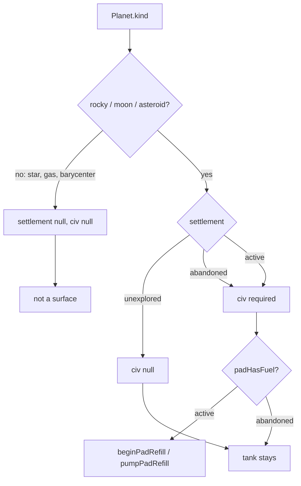
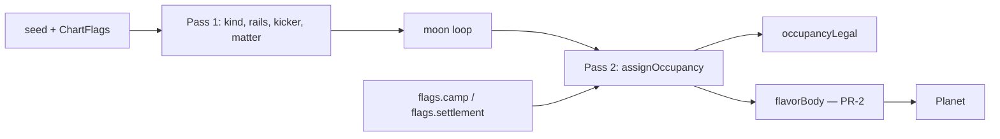
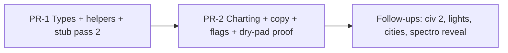

# Occupancy: Settlement and Civilization on Charted Bodies

| Field | Value |
|---|---|
| **Author** | Orbit |
| **Date** | 2026-09-17 |
| **Status** | Locked (shipped) |
| **Scope** | Client-side 2D space-flight (`src/game/*`). Local procedural charting. No occupancy persistence, no server sim, no multiplayer occupancy. |

Player-facing catalog: Notion [Mundos](https://app.notion.com/p/3dfa554c3c40810b838edf3fe5cceecd). **This file is the implementation lock** (types, weights, flags, PR split). Do not copy PR plans back to Notion.

This document locks the occupancy model, the first-pass gameplay, charting weights, flag precedence, and the PR split. Product decisions in **Key Decisions** are final — do not reopen them in implementation PRs.

---

## Overview

Orbit charts stars, rocky worlds, gas giants, moons, asteroids, and barycenters as one flat `Planet` bag (`src/game/types.ts`). Flavor today is a free-string `kicker` (`Home`, `Workshop`, `Camp`, `Moon`, …) plus `title` / `body`. Services cheat off that string: `padHasFuel` in `src/game/asteroid.ts` refuels every non-asteroid and only asteroid `kicker === "Camp"`. There is no first-class settlement, so a dead Archive still fills the tank, every moon is the same quiet line, and a future alien civilization has nowhere to live except another kicker string.

The change is two orthogonal fields on `Planet` — `settlement` and `civ` — with helpers for the rules. `settlement` drives services (methane pads). `civ` drives flavor and later compatibility. `kicker` stays a short label. Occupancy is world truth, charted in `makeSystem` and discarded with the system; player knowledge stays `scannedIds`. First occupancy PRs ship `CivId = "human"` only. Adding a second civilization is a new catalog id plus a copy table, not a rewrite of `Planet`.

---

## Background & Motivation

### Current state

`Planet` is already a wide flat struct (`src/game/types.ts`):

```45:84:src/game/types.ts
export type Planet = {
  id: string;
  name: string;
  kind: PlanetKind;
  // ... kinematics, palette, orbit rails ...
  kicker: string;
  title: string;
  body: string;
  href?: { label: string; url: string };
  deny?: string;
  shapeSeed?: number;
  padAngle?: number;
  matter: MatterProfileId | null;
  bulk: Mix;
  atmosphere: Mix;
};
```

`PlanetKind = "star" | "rocky" | "gas" | "moon" | "asteroid" | "barycenter"`. Closed catalogs already exist next to it (`SubstanceId`, `MatterProfileId`) and grow by union member + table, not by free strings.

`makeSystem` in `src/game/world.ts` is the only chart:

- Rocky seat 0 is always `ROCKY_ROLES[0]` (`kicker: "Home"`). Remaining rocky singles shuffle Workshop / Signal / Archive. Twins are `kicker: "Twin"` on both bodies; the barycenter is `kicker: "Pair"`.
- Gas giant: `kicker: "Giant"`, not landable. Its moons are all `kicker: "Moon"` with the same quiet body line.
- Asteroid belt: `wantBelt = flags.belt === true ? true : flags.belt === false ? false : rng() < 0.34`. Inside a belt, `const camp = rng() < 0.2` then `extraLand = n >= 6 && rng() < 0.4`; `inhabited = primary && camp`; kicker `Camp` / `Rock` / `Shard`.
- Star / gas / barycenter are not landable.

Fuel is an asteroid special case, not a world property:

```61:65:src/game/asteroid.ts
/** Pads load methane. Empty belt rocks do not. */
export function padHasFuel(p: Pick<Planet, "kind" | "kicker">) {
  if (p.kind !== "asteroid") return true;
  return p.kicker === "Camp";
}
```

Production call sites are all in `src/game/sim.ts`:

- `shipIsRefueling(sim)` (~1989–1995): landed + methane (`DEFAULT_FUEL_KIND`) + tank not full + `padHasFuel(pad)`. This is the HUD / audio gate.
- Landed phase `pumpPadRefill` (~2152): `if (padHasFuel(p)) pumpPadRefill(ship, dt)`.
- Contact `beginPadRefill` (~2631): `if (padHasFuel(p)) beginPadRefill(s)`.
- Hull repair is a separate `repairShipHull(sim, dt)` / `shipIsRepairing(sim)` and does not read kicker.

`src/game/runtime.ts` does **not** import `padHasFuel`. HUD `refueling` is `shipIsRefueling(sim)` (~316). Audio uses the same helper (~712). Do not add a `runtime.ts` import.

Hull repair is already “you are sitting on a solid body.” `repairShipHull` uses `hullSafeKind` (`landed` | `orbit` | `lagrange`) and `hullRepairRate` from `src/game/hull.ts`. Landed repair is a 15 s pit stop (`HULL_REPAIR_LAND_S = 15`). That must stay ungated on settlement.

Copy is kicker-driven. Overlay title list (`src/game/Overlay.tsx`) prints `p.kicker`. The landing card prints `planet.kicker` + `planet.body`. `rockyProfileId(kicker)` in `src/game/matter.ts` maps Home / Workshop / Signal / Archive / Twin onto locked recipes. Matter must not start reading occupancy.

### Pain points

1. **Services are encoded in flavor strings.** `kicker === "Camp"` is a database. A dead Workshop cannot exist; a dry Home cannot be expressed without breaking the title list.
2. **Moons have no variance.** `makeSystem` always writes `kicker: "Moon"` and one body line. They are the biggest flavor win for occupancy.
3. **Rocky worlds all refuel.** `padHasFuel` returns true for every non-asteroid, so Home is not special as a logistics node. Archive copy already reads abandoned and still fills the tank.
4. **No place for a civilization.** Abandoned-human vs abandoned-ashen cannot be a kicker convention. `MatterProfileId` already shows how a closed catalog should grow; occupancy should follow that pattern.
5. **Camps are hard to find while testing.** Empirically, `{ belt: true }` on seeds 1–200 yields a Camp on **47 / 200 = 23.5%** of charts (the roll is `rng() < 0.2` on the primary). Without a belt flag, belts are **66 / 200 = 33%** of charts and camps are **11 / 200 = 5.5%** of worlds (~0.34 × 0.20 ≈ 7% expected). `?belt` does not force a Camp. There is no `?camp` flag. `chartFlagsFromSearch` today only parses `twins` and `belt`.

### What this is not

Charting is local and procedural. `createSystem` in `src/game/world.ts` builds an in-memory `ChartedSystem` and stashes it in a module global. Warp (`punchWarp` in `src/game/sim.ts`) calls `createSystem(undefined, {}, pal, name)` and copies planets onto the sim. URL flags already apply to every warp via `{ ...fromUrl, ...flags }` — `?camp` / `?settlement=` persist across warp the same way `?belt` already does. There is no occupancy column, no save blob, no server authority, no multiplayer occupancy. Auth / PGLite in this repo are unrelated. Do not invent migrations, feature flags-as-a-service, or telemetry for this change.

---

## Goals & Non-Goals

### Goals (first occupancy pass)

- Add `settlement` and `civ` to `Planet` with the locked invariants.
- Drive methane pads off `settlement === "active"`.
- Keep hull repair on any landing (and on orbit / Lagrange locks).
- Chart occupancy in `makeSystem` with the locked weights and flag precedence. Home is always active human.
- Replace nested kicker/fuel ifs with helpers + a copy lookup keyed by kicker × settlement × civ.
- Keep kickers as short labels (`Home`, `Camp`, `Archive`, `Moon`, …). Do not encode occupancy in new kicker strings.
- Keep matter keyed by existing kicker / kind (`rockyProfileId`, `asteroidProfileId`, …).
- Add `?camp` and `?settlement=` chart flags in the existing `chartFlagsFromSearch` style; `makeSystem` is the source of truth for `flags.camp` implying a belt.
- Cover invariants, weights, flags, and pad behavior with node:test tests next to the existing game tests.

### Non-goals (explicitly later)

- A second `CivId`. First pass is `"human" | null` only.
- Unknown-civ ruins, mixed occupancy on one body, alien fuel grades, “fittings don’t match.”
- Pad lights, city drawing, or any canvas change in `src/game/draw.ts`.
- Fog of war on occupancy. Spectro does not become the civ field.
- Gating hull repair on settlement.
- Occupancy on stars, gas giants, or barycenters.
- Persisting occupancy across reloads, warps, or users.
- Replacing kickers, or teaching `rockyProfileId` about settlement.
- A new HUD occupancy widget. Title list still shows kicker. Landing card still shows kicker + body.

---

## Key Decisions

1. **Two flat fields, not a tagged `Occupancy` union.** `Planet` is already a wide bag; rules already live in helpers (`padHasFuel`, `isGhostBody`). A tagged union is type-safer and was rejected for consistency. Invariants are `occupancyLegal` tests, not the type checker’s job alone.

2. **`settlement` drives services; `civ` drives flavor / later compatibility; `kicker` is a label.** Fuel, and later pad lights, read settlement. The occupancy **copy table**, later fuel grade, and fittings read civ. Matter recipes stay keyed by kicker / kind (`rockyProfileId` / `ROCKY_BY_KICKER`) — occupancy does not pick mixes. `Camp` / `Archive` / `Home` stay short words on the title list.

3. **Occupancy is world truth. `scannedIds` is player knowledge.** Spectro (`sim.scannedIds` in `src/game/sim.ts`, filled by `stepSpectro`) may later *reveal* a civ. It must not *be* the civ field. Landing on an empty pad is enough to know it is empty; you are standing on it.

4. **`unexplored` plus a civ is invalid.** Unknown-civ ruins are a later fourth status or `civ: "unknown"`, not a misuse of unexplored. Do not represent “ruins of someone we cannot name” in v1.

5. **Fuel is civilization. Hull is geology.** `padHasFuel` becomes `settlement === "active"`. `repairShipHull` stays a pit stop on any landable contact. Abandoned and unexplored pads are dry. Home remains the reliable refill.

6. **Closed `CivId` catalog from day one.** Persist `"human"`, later named ids (`ashen`, `veil`). Never persist `"civ1"` / `"civ2"`. Grow the union the same way `MatterProfileId` grows in `src/game/types.ts` + `src/game/matter.ts`.

7. **First pass ships human only.** Abandoned human and active human both work. Adding civ 2 is a new `CivId` plus a copy table, not a `Planet` rewrite.

8. **Shards are `unexplored`, not `null`.** `settlement: null` is reserved for bodies that are not surfaces (star, gas, barycenter). Shards are rocks that are too small to land (`landable: false`, `deny: "Too small to land"`). Landability is already `landable`. Occupancy answers “are there traces?”, and the answer is no. `civ` is null. `?settlement=` does not apply to shards. See [Shards](#shards-are-unexplored-not-null).

9. **`?belt` only forces a belt.** The Camp roll stays `rng() < 0.2` on the primary (`i === 0`). Add `?camp` because that 20% roll (≈ 7% of unflagged worlds) is too rare to hunt while testing. `makeSystem` treats `flags.camp === true` as `wantBelt = true`; the URL parser is not the source of truth.

10. **Matter stays keyed by kicker / kind.** Occupancy must not change `rockyProfileId("Archive") === "rocky-archive"`. A dead Workshop is still iron-heavy.

11. **No cloud rollout.** Land types, then charting. Rollback is git revert. Debug flags are URL search params, matching `?belt` / `?twins` / `?dev`.

12. **Occupancy is a second pass at the end of `makeSystem`.** After the moon loop, bodies already have kind / kicker / landable / matter. Then write `settlement` / `civ` / (PR-2) `body`. Do not call `rollSettlement` inside `drafts.forEach`. That keeps today’s entire structural prefix, including the Camp roll and `extraLand`.

13. **Kicker is an occupancy-invariant key for Home / Camp / Shard.** `occupancyLegal` reads `kicker` and `landable`. `padHasFuel` does not.

14. **Asteroid occupancy is a mining camp on the pad.** Active and abandoned landable rocks share derrick sites (1 on medium, 2 on primary). Unexplored rocks and shards have no towers.

15. **Rocky occupancy is power on the night side.** Active: warm window clusters on the umbra (Home densest). Abandoned: same sites as dark day-side ticks, light dust wash, no extra craters. Unexplored: unmarked. No derricks, no red beacons, no skylines.

16. **Moon occupancy is one outpost.** A pad, comms dish, and a tight cluster of sheds on the limb — not a moon-wide city, not a mine. Active glows at night. Abandoned is the same buildings in charcoal/grey, no lights. Unexplored moons stay cratered discs.

---

## Proposed Design

### Occupancy model

```ts
export type Settlement = "active" | "abandoned" | "unexplored";
export type CivId = "human"; // closed catalog; add real named ids later

// on Planet
settlement: Settlement | null; // null = star / gas / barycenter
civ: CivId | null;             // null unless settlement is active or abandoned
```

| Settlement | `civ` | Meaning |
|---|---|---|
| `unexplored` | `null` | No traces. Nobody to name. |
| `abandoned` | required | Empty pad, identifiable builders. |
| `active` | required | That civilization is here now. |
| `null` | `null` | Not a surface: star, gas giant, barycenter. |

Invariants (enforced by `occupancyLegal`, asserted in tests over every `createSystem` seed **and** table-driven illegal fixtures):

- `kind ∈ {star, gas, barycenter}` ⇒ `settlement == null && civ == null`.
- `kind ∈ {rocky, moon, asteroid}` ⇒ `settlement != null`.
- `settlement === "unexplored"` ⇒ `civ == null`.
- `settlement === "active" | "abandoned"` ⇒ `civ != null`.
- Home (`kicker === "Home"`) ⇒ `{ settlement: "active", civ: "human" }`.
- Camp (`kicker === "Camp"`) ⇒ `{ settlement: "active", civ: "human" }`.
- Shard (`kind === "asteroid" && !landable`, or `kicker === "Shard"`) ⇒ `{ settlement: "unexplored", civ: null }`.
- `unexplored` plus a civ is invalid. Do not represent that.
- `Rock` + `active` is **legal** (debug `?settlement=active` on leftover landable asteroids). Do not rename Rock → Camp.

`isGhostBody` (`src/game/world.ts`) stays `p.kind === "barycenter"`. Ghost means “kinematic parent only — no gravity, hull, or drawing.” Do not reuse it for abandoned pads.



### What each field is for

| Field | Reads it | Does not read it |
|---|---|---|
| `settlement` | `padHasFuel`, later pad lights | matter recipes, spectro `scannedIds`, hull repair |
| `civ` | copy table, later fuel grade / fittings | `padHasFuel` in v1 (human methane is the only pad grade) |
| `kicker` | title list, landing-card eyebrow, `rockyProfileId`, Home lookup (`kicker === "Home"`), **`occupancyLegal` for Home / Camp / Shard** | `padHasFuel` |
| `landable` | contact landing vs crash (`canLand` in `sim.ts`), **`occupancyLegal` for shards** | `padHasFuel` |
| `scannedIds` | spectro HUD / composition readout | occupancy fields |

### Helpers

New module `src/game/occupancy.ts`. Keep geometry in `src/game/asteroid.ts`. Move the *meaning* of `padHasFuel` here. The only production import to retarget is `src/game/sim.ts` (`shipIsRefueling`, landed `pumpPadRefill`, contact `beginPadRefill`). `runtime.ts` keeps calling `shipIsRefueling(sim)` — do not add a `padHasFuel` import there.

```ts
import type { CivId, Planet, PlanetKind, Settlement } from "./types.ts";

export function isOccupiableKind(kind: PlanetKind): boolean {
  return kind === "rocky" || kind === "moon" || kind === "asteroid";
}

export function occupancyLegal(
  p: Pick<Planet, "kind" | "kicker" | "landable" | "settlement" | "civ">,
): { ok: boolean; reason?: string } {
  const occupiable = isOccupiableKind(p.kind);
  if (!occupiable) {
    if (p.settlement != null || p.civ != null) {
      return { ok: false, reason: `${p.kind} must have null occupancy` };
    }
    return { ok: true };
  }
  if (p.settlement == null) return { ok: false, reason: `${p.kind} needs settlement` };
  if (p.settlement === "unexplored") {
    if (p.civ != null) return { ok: false, reason: "unexplored cannot carry a civ" };
  } else if (p.civ == null) {
    return { ok: false, reason: `${p.settlement} requires civ` };
  }
  if (p.kicker === "Home") {
    if (p.settlement !== "active" || p.civ !== "human") {
      return { ok: false, reason: "Home must be active human" };
    }
  }
  if (p.kicker === "Camp") {
    if (p.settlement !== "active" || p.civ !== "human") {
      return { ok: false, reason: "Camp must be active human" };
    }
  }
  const shard = p.kicker === "Shard" || (p.kind === "asteroid" && !p.landable);
  if (shard && (p.settlement !== "unexplored" || p.civ != null)) {
    return { ok: false, reason: "Shard must be unexplored with civ null" };
  }
  return { ok: true };
}

/** Pads load methane. Active settlements only. */
export function padHasFuel(p: Pick<Planet, "settlement">): boolean {
  return p.settlement === "active";
}

/** One draw. Weights must sum to 1. */
export function rollSettlement(
  rng: () => number,
  w: { active: number; abandoned: number; unexplored: number },
): Settlement {
  const r = rng();
  if (r < w.active) return "active";
  if (r < w.active + w.abandoned) return "abandoned";
  return "unexplored";
}
```

Rocky non-Home CDF: `r < 0.25` → active, `r < 0.65` → abandoned, else unexplored.

Moon CDF: `r < 0.03` → active, `r < 0.15` → abandoned, else unexplored.

Leftover Rock (no `flags.settlement`): `r < 0.08` → abandoned, else unexplored (`active` weight 0).

Delete the old `padHasFuel` from `asteroid.ts` in the same PR that introduces `occupancy.ts`. Do not leave a kicker-based wrapper that would hide call sites still passing `{ kind, kicker }`.

### Charting: two passes

Today `makeSystem` writes kicker and body inline (rocky `role.body(name)`, asteroid ternary, one moon sentence). Occupancy adds a third axis.

`drafts` is `[rocky/pair seats…, belt?, gas]`. `drafts.forEach` therefore builds every rocky and both twins **before** the belt branch where `const camp = rng() < 0.2` runs. Rolling occupancy next to `role.body(name)` would consume stream before Camp, `extraLand`, asteroid names, and moons.

**Lock:** occupancy is a **second pass at the end of `makeSystem`**, after the moon loop, still on the same `mulberry32` stream.

1. **Pass 1 (unchanged structure).** Kind, rails, names, palettes, kickers, matter, landable, `deny`. Belt Camp kicker still decided here. Body may be written as today’s strings; PR-2 overwrites occupiable `body`.
2. **Pass 2 (`assignOccupancy`).** Write `settlement` / `civ`. PR-2 also writes `body` from `flavorBody`. Extra occupancy `rng()` calls happen here, after every name / orbit / `camp` / `extraLand` / moon has been consumed. They do **not** reshuffle today’s chart structure. `createSystem`’s nearby headings use a different stream (`mulberry32(seed ^ 0x51ed)`), also unaffected.



Kickers are **not** recomputed from occupancy except where they already were a belt label (`Camp` / `Rock` / `Shard`) in pass 1. `flags.settlement=active` on a leftover Rock does **not** rename it to Camp.

### Flag precedence (locked)

`chartFlagsFromSearch` parses `camp` via existing `flagOn`, and `settlement` as one of the three literals (unknown values ignored, same as unknown `twins`). The parser does **not** set `belt: true` when it sees `camp`. `makeSystem` is the source of truth:

```ts
const wantBelt =
  flags.camp === true || flags.belt === true
    ? true
    : flags.belt === false
      ? false
      : rng() < 0.34;
```

Inside the belt branch, **always consume** the Camp draw so `extraLand` stays on the same stream position whether the flag is set or not:

```ts
const campRoll = rng() < 0.2; // always consume; sits where `const camp = rng() < 0.2` is today
const camp =
  flags.camp === true ? true : flags.camp === false ? false : campRoll;
const extraLand = n >= 6 && rng() < 0.4;
```

Pass 2 then applies occupancy with this precedence (first match wins):

| Priority | Rule |
|---|---|
| 1 | `kind ∈ {star, gas, barycenter}` → `settlement: null`, `civ: null`. Leave `body` as pass 1. |
| 2 | Home (`kicker === "Home"`) → always `{ active, human }`. Ignore `flags.settlement`. |
| 3 | Shard (`kind === "asteroid" && !landable`, or `kicker === "Shard"`) → always `{ unexplored, civ: null }`. Ignore `flags.settlement`. |
| 4 | `kicker === "Camp"` → `{ active, human }`. This covers `flags.camp === true` (pass 1 already set the primary kicker) **and** a natural 20% Camp. Ignore `flags.settlement`. |
| 5 | `flags.settlement` set → remaining occupiable **non-Home landables** (Workshop / Signal / Archive / Twin, moons, leftover `Rock`s). `civ` is `"human"` for active/abandoned, `null` for unexplored. **Do not rename Rock → Camp.** |
| 6 | Else natural weights (`rollSettlement`). |

Worked conflicts:

| Flags | Result |
|---|---|
| `{ camp: true }` (no `belt`, including node tests with no `window`) | `wantBelt = true`; primary `Camp` + active human. |
| `{ camp: true, belt: false }` / `?camp=1&belt=0` | **Camp wins:** `wantBelt = true`; primary Camp. |
| `{ camp: false, belt: true }` / `?camp=0&belt=1` | Belt, no Camp. Leftover primary is `Rock`. |
| `{ belt: true }` only | Belt; Camp still `rng() < 0.2`. |
| `{ settlement: "abandoned" }` | Home active; shards unexplored; natural Camp stays active human; other landables abandoned. |
| `{ camp: true, settlement: "abandoned" }` | Camp stays active; other landables abandoned; shards unexplored. |
| `{ settlement: "active" }` | Leftover `Rock`s become **active** with kicker still `"Rock"`. Copy cell `Rock:active` exists. |
| `{ mine: "active" }` / `?mine` | Sugar: `camp: true`. Lit Camp with two derricks. |
| `{ mine: "abandoned" }` / `?mine=abandoned` | Sugar: `belt: true`, `camp: false`, `settlement: "abandoned"` if unset. Dead primary Rock, two wrecked derricks. No Camp. |
| `{ mine: "both" }` / `?mine=both` | Sugar: `camp: true`, `settlement: "abandoned"` if unset, **always** a second landable. Camp stays active; extra Rock is abandoned (one derrick). |

`?mine` is parsed as a literal (`active` / `abandoned` / `both`). Bare `?mine` is `active`. The parser does **not** set `belt` or `camp`; `withMineFlags` / `makeSystem` is the source of truth. Explicit `flags.settlement` still wins over mine sugar (so `?mine=both&settlement=unexplored` keeps leftovers unexplored; Camp stays active).

`createSystem(seed, flags)` already merges `chartFlagsFromSearch(window.location.search)` under explicit flags (`{ ...fromUrl, ...flags }`). Tests pass `{ camp: true }` the same way they pass `{ belt: true }` today. Node tests have no `window`, so URL parsing is unit-tested via `chartFlagsFromSearch("?camp")` directly; belt implication is tested through `createSystem(seed, { camp: true })`, which must **always** chart a belt with a Camp.

There is no `?civ=` in v1 (`CivId` has one value).

Debug recipes (URL or `createSystem` flags):

| Want | Flag |
|---|---|
| Abandoned rocky worlds / moons / leftover rocks | `?settlement=abandoned` |
| Active leftover rocks and worlds (Home already is) | `?settlement=active` |
| Lit asteroid mine | `?mine` or `?mine=active` |
| Dead asteroid mine | `?mine=abandoned` |
| Lit Camp beside a wrecked extra rock | `?mine=both` |

### Copy lookup

```ts
kind × kicker × settlement × civ  →  body
```

Exact prose is written in PR-2. The **cell set** is architecture: every legal `(kicker, settlement)` cell below must have a row. `flavorBody` **throws** on a missing key (tests pin that). No silent kind-level fallback.

```ts
export function flavorBody(args: {
  kind: PlanetKind;
  kicker: string;
  settlement: Settlement | null;
  civ: CivId | null;
  name: string;
  ctx?: { gasName?: string; twinName?: string };
}): string {
  if (args.settlement == null) {
    throw new Error(`flavorBody is not for null occupancy (${args.kind})`);
  }
  const key = `${args.kicker}:${args.settlement}:${args.civ ?? ""}`;
  const row = COPY[key];
  if (!row) throw new Error(`missing occupancy copy: ${key}`);
  return row(args);
}
```

Null-occupancy bodies (Star / Giant / Pair) keep pass-1 `body`. Occupiable bodies get `flavorBody` in pass 2 (PR-2).

#### Legal `(kicker, settlement)` cells (v1, `civ` is `"human"` unless unexplored)

| Kicker | active | abandoned | unexplored |
|---|---|---|---|
| Home | yes — keep the cradle line | illegal | illegal |
| Workshop | yes — keep “things get built…” | yes — dead floor, jigs still standing | yes — no one named this; empty tank |
| Signal | yes — keep the cold radio world | yes — mast still points; nobody answers | yes — no one named this |
| Archive | yes — dust libraries, still staffed | yes — keep “still in orbit around the idea of it” | yes — no one named this |
| Twin | yes — bound-pair sentence + staffed pad, tank fills | yes — bound-pair sentence + empty pad, dead lights | yes — bound-pair sentence + no one named this, tank empty |
| Camp | yes — keep “someone bolted a light… the tank still fills” | illegal | illegal |
| Rock | yes — working pad on a belt rock that is **not** labeled Camp; tank fills. Debug `?settlement=active` only in natural weights (active weight 0). | yes — empty pad, dead lights, tank stays empty | yes — keep “no one named this… the tank stays empty” |
| Shard | illegal | illegal | yes — keep “grit on the rail. Too small to land” |
| Moon | yes — someone lives in the giant’s shadow; tank fills | yes — empty pad, dead lights | yes — keep the quiet-moon line; tank stays empty |

Twins still roll **independently** (one staffed, one empty is a feature). Each twin is its own row in pass 2. Barycenter stays null occupancy.

`Camp:abandoned` and `Home:abandoned` are not copy cells; `occupancyLegal` rejects them. Tests: enumerate every yes-cell and assert `flavorBody` returns a non-empty string; enumerate illegal combos as `occupancyLegal` fixtures.

Do not invent new kickers (`Ruins`, `Colony`, `Ashen`) in v1. A dead Workshop is still `Workshop`. Occupancy sits underneath.

### Charting weights (locked initial policy)

`civ` in v1 is `"human"` whenever settlement is `active` or `abandoned`, else `null`. Natural weights run only when precedence reaches row 6.

#### Home

Always `{ settlement: "active", civ: "human" }`. Seat 0 stays the cradle. `ROCKY_ROLES[0]` is Home in `src/game/world.ts`. `createSystem` still finds home with `planets.find((p) => p.kicker === "Home")`. `landOnHome` in `sim.ts` does the same. Do not switch those lookups to settlement.

#### Rocky others (Workshop, Signal, Archive, Twin)

Keep the existing role shuffle and Twin kicker. **Roll settlement independently of kicker.** Archive copy already reads abandoned, but a living Archive is allowed; a dead Workshop is allowed.

| Outcome | Weight | CDF |
|---|---|---|
| `active` | 0.25 | `r < 0.25` |
| `abandoned` | 0.40 | `r < 0.65` |
| `unexplored` | 0.35 | else |

This is what makes Home the reliable refill: three-quarters of non-home rockies are dry.

#### Moons

Biggest flavor win — they are identical today (`kicker: "Moon"`).

| Outcome | Weight | CDF |
|---|---|---|
| `active` | 0.03 | `r < 0.03` |
| `abandoned` | 0.12 | `r < 0.15` |
| `unexplored` | 0.85 | else |

Kicker stays `"Moon"`. Do not invent `Camp` on a moon.

#### Asteroids

Pass 1 keeps the current Camp **kicker** roll (always consume `rng()`, then maybe override from flags). Pass 2 occupancy:

| Body | Occupancy | Kicker |
|---|---|---|
| Primary and `camp` | `active` + `human` (precedence 4) | `Camp` |
| Other landable (primary without camp, or medium `extraLand`) | if `flags.settlement` → that value; else 0.08 abandoned + human, else unexplored | `Rock` |
| Shard (`!landable`) | `unexplored`, `civ` null (precedence 3) | `Shard` |

`?belt` still only forces a belt. It does not set `camp`. Medium extra landables never become Camp (same as today: `inhabited = primary && camp`). Abandoned is a rare *landable*. Do not put abandoned on shards.

#### Stars, gas giants, barycenters

`settlement: null`, `civ: null`. Do not apply occupancy. Kickers stay `Star` / `Giant` / `Pair`.

### Shards are `unexplored`, not `null`

Pick and justification, locked:

- `settlement: null` means “not a surface worth occupying” and is used for star, gas, barycenter — bodies you cannot stand on, with `landable: false` for a *kind* reason (heat, atmosphere, ghost parent).
- Shards are still `kind: "asteroid"`. They have a silhouette, a spectro mix, a `deny: "Too small to land"`. The reason you cannot land is size (`landable: false`), not kind.
- Occupancy answers traces of civilization. A grit spec has none → `unexplored`, `civ` null.
- Every `rocky | moon | asteroid` has a `Settlement`. `padHasFuel` does not special-case shards (they are not `active`). `occupancyLegal` **does** special-case them so `?settlement=` cannot produce `Shard` + abandoned/active.
- `flags.settlement` applies to landables only (precedence 5). Shards ignore it.

Do not set shards to `null` in one PR and `unexplored` in another.

### Gameplay (first occupancy pass)

| State | Land | Fuel | Hull | Copy |
|---|---|---|---|---|
| **Active** | yes | methane pad (`PAD_REFILL_RATE = 3` L/s, dumps other grades) | pit-stop repair | people are here |
| **Abandoned** | yes | none | still repairs | empty pad, dead lights |
| **Unexplored** | yes | none | still repairs | no one named this |
| **null** | no (or not a surface) | — | — | star / giant / barycenter |

Landing contact: `canLand = p.landable && phase === "flight" && rel < LAND_SPEED && vn < 20`. Occupancy does not change that. Shards still crash (`"a slow hit on a shard still crashes; it is not a pad"` in `asteroid.test.ts`).

`beginPadRefill` / `pumpPadRefill` in `src/game/fuel.ts` stay methane-only. Occupancy decides *whether* the pad runs, not *what* it pumps. Alien fuel is a later civ mechanical difference.

HUD `refueling` is `shipIsRefueling(sim)` in `runtime.ts`, which already keys off `padHasFuel`. After the helper change, a landed abandoned Workshop shows fuel not pumping and hull still repairing (`shipIsRepairing` is hull < max + `hullSafeKind`, no pad check). No new HUD field.

Title list still shows kicker (`Camp` / `Rock` / `Workshop`). Occupancy flavor is the landing-card `body`. That is enough for v1; you see it when you sit down.

### Spectro

`scannedIds: Set<string>` on `Sim` is player knowledge of composition. `stepSpectro` requires an orbit lock and `canScan` (`src/game/matter.ts`). Occupancy is filled at chart time and is true whether or not the player has scanned.

Later (not v1): spectro may reveal *which* civ built an abandoned pad if copy wants to hold that back from the landing card. That is a reveal of an existing `civ` field, not a third occupancy axis. Do not store “known civ” on `Planet`.

### Matter

Unchanged:

```381:383:src/game/matter.ts
export function rockyProfileId(kicker: string): MatterProfileId {
  return ROCKY_BY_KICKER[kicker] ?? "rocky-home";
}
```

Camps still force `asteroid-silicate` when inhabited (pass 1). Occupancy does not pick recipes. Tests in `src/game/matter.test.ts` (`rocky kickers map onto the closed recipes`, `charted bodies carry a legal locked mix`) stay valid.

### Canvas / HUD

Overlay title list and landing card keep printing `kicker` and `body`.

#### Rocky worlds (human, locked)

Layout lives in `rockySettlement` (`src/game/occupancy.ts`); `drawRockySettlement` in `src/game/draw.ts` hashes sites from radius/mass so they spin with the disc. You can land anywhere — no pad, no derricks. Unexplored rockies stay the current six blobs.

| Body | Night sites |
|---|---|
| Home | 9 (always active, densest glow) |
| Other rocky (Workshop / Signal / Archive / Twin) | 5 |
| Unexplored | 0 |

Same sites for active and abandoned. Occupancy is lit vs dead, not kicker architecture.

| | Active | Abandoned |
|---|---|---|
| Districts | Pale pads + dark roofs at every site, day and night. Spin with the disc. | Same sites, darker broken blocks, no pale pads |
| Night | Warm amber glow on top of the district (`lighter`). Steady; not obstruction flashes. | No glow. Night districts vanish into the umbra. |
| Day | Districts read as built patches on the lit face | Darker ruin patches, more contrast, light dust wash |
| Surface | Current blobs | Light dust wash only — **not** extra craters |
| Atmo halo | Unchanged | Unchanged |

LOD: at system zoom, districts are 2 blocks per site (Home still densest). Close up they break into 4–5 hashed rects. Night glow still only on the umbra. Twins follow the same rules independently.

#### Moons (human, locked)

One outpost in the giant’s shadow. Layout lives in `moonOutpost`; `drawMoonOutpost` parents to `rotate` so the pad sits on the limb. The mast/dish sticks **out** of the silhouette so it reads at system zoom.

| | Active | Abandoned | Unexplored |
|---|---|---|---|
| Pad | Pale landing apron | Dark apron | None |
| Habitat | Roof box plus a tight cluster of extra sheds around the pad | Same cluster, charcoal / grey, no pale pads | None |
| Mast | Steel spike + dish | Complete, rustier | None |
| Night | Warm glow on the habitat if the outpost is in umbra | No glow | — |

Still one outpost, not a moon-wide city. Not a mine (no derrick, no red beacon). Same site for active and abandoned.

#### Asteroid mines (human, locked)

Landable `active` / `abandoned` asteroids are mining camps. Layout lives in `asteroidMine` (`src/game/occupancy.ts`); `drawAsteroidMine` in `src/game/draw.ts` parents to `rotate` + `padAngle` so gear spins with the rock. Towers stick **out** of the silhouette (not clipped). The ship lands in the pad center — derricks sit on the **shoulders** (`padAngle ± 0.28`).

| Body | Towers |
|---|---|
| Primary (`radius >= 26`) | 2 |
| Medium extra (`radius < 26`) | 1 |
| Unexplored Rock, Shard | 0 |

Same derrick sites for active and abandoned (same `shapeSeed`). Abandoned towers stay **complete** — the wasteland is the rock, not a snapped mast.

| | Active | Abandoned |
|---|---|---|
| Surface | Normal silicate blobs | Dark wash, more pits, crater rims |
| Derrick | Tapered A-frame + drill string | Same complete A-frame, rustier stroke |
| Tower lamp | Red obstruction beacon (hot core + glow). Flashes ~30/min, towers on one rock in sync. Steady if reduced motion. | Seeded: **off** (dark lens) or a **very dim irregular flicker**. Reduced motion: flicker stays off. |
| Pad | Two landing dots on the chord, center clear | Dark |
| Night body | 2–3 specks on the umbra, close zoom only | None |

LOD: at belt zoom the tell is a tapered spike + flashing red crown glow. No habitats, dishes, or a second structure type. A later civ swaps palette, not geometry.

---

## API / Interface Changes

### `src/game/types.ts`

Add the closed unions and two fields on `Planet`:

```ts
export type Settlement = "active" | "abandoned" | "unexplored";
export type CivId = "human";

export type Planet = {
  // ...existing fields...
  kicker: string;
  title: string;
  body: string;
  settlement: Settlement | null;
  civ: CivId | null;
  // ...
};
```

Grow `CivId` later exactly like `MatterProfileId`: union member + table rows. Never `"civ1"`.

### `src/game/asteroid.ts`

Remove `padHasFuel`. Geometry (`surfaceRadius`, `asteroidLandedRadius`, …) stays.

### `src/game/occupancy.ts` (new)

`isOccupiableKind`, `occupancyLegal`, `padHasFuel`, `rollSettlement`, and (PR-2) `flavorBody`.

### `src/game/world.ts`

- `ChartFlags` gains `camp?: boolean`, `settlement?: Settlement`, and `mine?: "active" \| "abandoned" \| "both"`.
- `chartFlagsFromSearch` parses them independently. It does not force `belt` when it sees `camp` or `mine`.
- `withMineFlags` (inside `makeSystem`) is the source of truth for mine sugar.
- `makeSystem` `wantBelt` treats `flags.camp === true` as a belt. Belt branch always consumes one Camp `rng()` before `extraLand`. `mine: "both"` forces the extra landable.
- Pass 2 `assignOccupancy` at the end, after the moon loop.

### `src/game/sim.ts`

Import `padHasFuel` from `./occupancy.ts`. Keep `shipIsRefueling` as the HUD / audio gate (`runtime.ts` already calls it). No other sim-loop change in v1: landed fuel already branches on the helper; hull already does not.

### `src/game/runtime.ts`

No occupancy import. `refueling: shipIsRefueling(sim)` stays.

### Test fixtures

`shape()` in `src/game/asteroid.test.ts` must add `settlement` / `civ`. Any other `Planet` object literals will fail typecheck until they do — that is the point of required fields.

`padHasFuel` tests become:

```ts
assert.equal(padHasFuel({ settlement: "active" }), true);
assert.equal(padHasFuel({ settlement: "abandoned" }), false);
assert.equal(padHasFuel({ settlement: "unexplored" }), false);
assert.equal(padHasFuel({ settlement: null }), false);
```

Two tests currently mutate `kicker` to drive fuel and will go red in PR-1 unless retargeted:

- `src/game/asteroid.test.ts` `"empty rocks do not pump methane; camps do"`
- `src/game/fuel.test.ts` `"dry belt rocks are not refueling"` (asserts `shipIsRefueling`)

Both must set `settlement` / `civ` (and may keep kicker in sync for copy, but fuel must not read it). Grep `kicker = "Camp"` / `kicker = "Rock"` in `src/game/*.test.ts` at PR-1 — those two hits are the list today.

`fuel.test.ts` `"a landing pumps CH4 over time instead of topping off"` and `"shipIsRefueling is only a methane pad below capacity"` use `createSystem(1)` and the default Home pad — still valid because Home stays active.

---

## Data Model Changes

There is no durable schema.

`Planet` lives in the in-memory `ChartedSystem` (`world.ts` module global `system`) and is copied onto `Sim.planets` at `createSim` / warp. Occupancy is re-rolled every `createSystem(seed, flags)`. Warp (`punchWarp`) charts a new seed and throws the old planets away. URL flags on `window.location.search` still apply.

No PGLite migration. No `localStorage` occupancy. No multiplayer occupancy in `src/lib/multiplayer`. If a later save format snapshots planets, it should persist `settlement` and `civ` as the closed-catalog strings (`"active"`, `"human"`), never `"civ1"`. That save format does not exist today — do not add it in these PRs.

### Migration strategy

TypeScript required fields *are* the migration: every `Planet` construction site in `makeSystem` and test fixtures must compile. There are no stored charts to backfill.

PR-1 stubs occupancy with a **behavior-preserving map** so existing fuel tests stay green while types land. Pass 2 exists in PR-1 but does not call `rollSettlement`:

| Body | Today `padHasFuel` | PR-1 stub `settlement === "active"` | PR-2 |
|---|---|---|---|
| Home / other rockies / moons | true | active → true | locked weights |
| asteroid Camp | true | active → true | active human |
| asteroid Rock / Shard | false | unexplored → false | Rock may roll abandoned or `?settlement=`; Shard stays unexplored |
| star / gas / barycenter | true (not landable) | null → false | null |

Star/gas/bary flipping to false is a no-op in play: `canLand` requires `p.landable`. Good split: do not ship PR-2 weights inside the types PR.

PR-1 gameplay ≈ today. PR-2 is the design change players feel (dry Workshops, moon variance, rare abandoned rocks).

---

## Alternatives Considered

### 1. Tagged union `Occupancy` on `Planet`

```ts
type Occupancy =
  | { status: "none" }
  | { status: "unexplored" }
  | { status: "abandoned"; civ: CivId }
  | { status: "active"; civ: CivId };
```

**Pros:** Impossible to represent `unexplored` + civ. Exhaustive switches. **Cons:** `Planet` stops being a flat bag; every helper that today takes `Pick<Planet, "kind" | "kicker">` grows a nested object; JSON-ish debug dumps get worse. **Rejected:** consistency with `matter` / `kicker` / `landable` as sibling fields, rules in helpers. Invariants are tested, not only typed.

### 2. Fold civilization into the settlement enum

`active_human` | `abandoned_ashen` | … **Pros:** one field. **Cons:** catalog explosion; fuel has to parse the prefix; adding civ 2 rewrites every switch. Occupancy services and civ flavor change on different clocks. **Rejected:** two orthogonal fields.

### 3. Encode occupancy in `kicker`

Add `Ruins`, `Colony`, keep `Camp` as the fuel bit. **Pros:** zero type changes; `padHasFuel` already reads kicker. **Cons:** this is the current bug. Matter keys, title list, and fuel all share one string. A dead Workshop cannot exist. **Rejected.**

### 4. Fog-of-war occupancy via `scannedIds`

Leave `civ` unset until spectro. **Pros:** a reason to scan. **Cons:** occupancy is standing on the pad — empty lights are visible without a mass spec. User locked world truth vs player knowledge as separate systems. Spectro-reveal of civ identity can still happen later without making `scannedIds` the civ field. **Rejected for v1 as the occupancy mechanism.**

### 5. `settlement: null` on shards

Treat unlandable rocks like gas giants. **Pros:** occupancy only on pads you can sit on. **Cons:** splits `kind: "asteroid"` into two occupancy regimes; `isOccupiableKind` grows a `landable` check; spectro still reads shards as bodies. **Rejected:** see [Shards](#shards-are-unexplored-not-null).

### 6. Interleave occupancy `rng()` at each body construction site

Natural to write next to `role.body(name)`. **Rejected:** rockies and twins are built before the belt `camp` roll. See [Charting: two passes](#charting-two-passes).

---

## Security & Privacy Considerations

Threat model is a local procedural toy. Occupancy is not user data.

- **Auth:** no change. Occupancy does not touch `src/lib/auth`, Better Auth, or PGLite. Do not add an occupancy table to `migrations/auth`.
- **Secrets:** none. `CivId` and `Settlement` are closed public catalogs.
- **Injection:** `body` strings are game copy rendered as React text in `Overlay.tsx`, not HTML. Keep it that way. Do not `dangerouslySetInnerHTML` occupancy flavor.
- **URL flags:** `?camp` / `?settlement=` are client chart cheats, same class as `?belt` and `?dev`. They are not privileges. They do not leave the tab. They persist across warp the same way `?belt` does (`punchWarp` → `createSystem(undefined, {}, …)` → `{ ...fromUrl, ...flags }`).
- **Multiplayer:** `src/lib/multiplayer` is out of scope. Do not sync occupancy. Two clients with the same seed already re-chart the same `makeSystem`; that is the only “shared world,” and it stays that way.

---

## Observability

There is no production telemetry, and this change does not add any.

- **Logging:** none required. Charting is deterministic given `seed` + `ChartFlags`.
- **Metrics / alerting:** none. This is not a service.
- **Debug:** URL flags (`?camp`, `?settlement=`, `?mine=`, existing `?belt`, `?dev`) are the observability. A `?dev` readout of `settlement`/`civ` on the verbose HUD is optional and **not** in the first PRs (no new HUD widget).
- **Tests are the monitor.** `occupancyLegal` over a seed sweep plus illegal fixtures, weight bands over 200 seeds, and `padHasFuel` / `shipIsRefueling` unit tests replace dashboards.

If a later verbose HUD line is wanted, print `settlement` next to kicker only under `hud.verbose` / `hud.dev`, never on the title list.

---

## Rollout Plan

This is a client game. There is no staged cohort, no feature-flag service, no canary.

1. Merge PR-1 (types + helpers + stub pass 2). Gameplay ≈ current fuel rules. Rollback: git revert.
2. Merge PR-2 (weights + copy + flags + dry-pad/hull proof). Players feel dry pads and moon variance. Rollback: git revert; Home still refuels if a hotfix is needed faster than revert, because Home is hardcoded active.
3. Ship. No migration window. No third occupancy PR.

`package.json` `test` is an **explicit file list** (warp, fuel, matter, spectro, asteroid, belt, hull, orbit-lock, input, camera, adrift — plus scripts and lib tests). Add `src/game/occupancy.test.ts` to that list in PR-1. A `src/game/*.test.ts` glob will not run it.

---

## Risks

| Risk | Severity | Mitigation |
|---|---|---|
| Fuel scarcity / stranding if too few active pads | Medium | Home is always active methane. Ship starts on Home with a full tank (`createSystem` pad spawn + `fillGrade` on reboot). Weights keep ~25% of other rockies active and ~20% of belt primaries as Camp. `?camp` for testers. |
| Leftover `kicker === "Camp"` fuel checks | Medium | Grep at PR-1. Production `padHasFuel` lives only in `sim.ts` today (via `shipIsRefueling` + pump/begin). Fail the PR if `padHasFuel` still takes `kicker`. |
| Test fixtures omit new required fields | Low | `tsc --noEmit` (`npm run typecheck`) and `shape()` updates. |
| Archive / Workshop copy disagrees with occupancy | Medium | Copy table in PR-2; missing key throws; landing-card `body` is the source of truth. |
| `?settlement=` fights `?camp` | Low | Locked precedence table. Tests: `{ camp: true }` always belts; `{ camp: true, settlement: "abandoned" }` keeps Camp active and dries other landables; `{ settlement: "abandoned" }` leaves shards unexplored and natural Camp active. |
| Forced `?camp` shifting `extraLand` | Low | Always consume one Camp `rng()` before `extraLand`, then override from flags. |
| Players expect pad lights / cities in v1 | Low | Explicit non-goal. Copy carries flavor. |

Pass 2 occupancy `rng()` does not shift names, rails, Camp kicker, `extraLand`, or moons. That is not a seed-break of chart structure; only `settlement` / `civ` / `body` are new.

---

## Open Questions

Locked product decisions are **not** listed here. Remaining implementation nits:

1. **Copy tone.** Cell set above is locked; final sentences are written in the charting PR and reviewed as prose, not as architecture.
2. **Verbose HUD.** A `?dev` occupancy line is useful but not required for v1. Default: omit.
3. **Abandoned-asteroid rate 0.08.** Initial policy, not a sacred number. If Camps + abandoned landables feel crowded, drop abandoned toward 0.05 in a follow-up — do not reopen the *existence* of rare abandoned rocks.
4. **Twin independence.** Locked independent, but if a pair with one active and one unexplored reads as a bug in playtest, a follow-up may copy occupancy from the first twin. Not v1.

Unknown-civ ruins, mixed occupancy, alien fuel, pad lights, city drawing, spectro-reveal of civ — tracked as follow-up PRs, not questions.

---

## References

- `src/game/types.ts` — `Planet`, `PlanetKind`, `MatterProfileId`, `SubstanceId`
- `src/game/world.ts` — `makeSystem`, `createSystem`, `ROCKY_ROLES`, `chartFlagsFromSearch`, `ChartFlags`, `isGhostBody`, belt `camp` then `extraLand`
- `src/game/asteroid.ts` — current `padHasFuel`
- `src/game/asteroid.test.ts` — `"chart flags parse belt independently of twins"`, `"?belt always charts a sparse belt with one landable primary"` (does **not** assert Camp), `"padHasFuel is only camps on asteroids"`, `"empty rocks do not pump methane; camps do"` (kicker mutation)
- `src/game/fuel.test.ts` — `"dry belt rocks are not refueling"` (kicker mutation + `shipIsRefueling`), `"shipIsRefueling is only a methane pad below capacity"`, Home landing pump
- `src/game/sim.ts` — `shipIsRefueling`, landed `pumpPadRefill`, contact `beginPadRefill`, `repairShipHull` / `shipIsRepairing`, `landOnHome`, `scannedIds` / `stepSpectro`, `punchWarp`
- `src/game/runtime.ts` — HUD `refueling: shipIsRefueling(sim)`; audio `setRefuel` via the same helper. No `padHasFuel` import.
- `src/game/hull.ts` — `HULL_REPAIR_LAND_S = 15`, ungated pit stop
- `src/game/fuel.ts` — `beginPadRefill`, `pumpPadRefill`, `PAD_REFILL_RATE = 3`, methane dump of other grades
- `src/game/matter.ts` — `rockyProfileId`, `ROCKY_BY_KICKER`, `withMatter`
- `src/game/Overlay.tsx` — title-list kicker, landing-card kicker + body
- `src/game/draw.ts` — no occupancy in v1
- `package.json` — `test` script is an explicit file list, not a `src/game/*.test.ts` glob
- `README.md` — local procedural charting
- Empirical (this doc, seeds 1–200): `{ belt: true }` → 23.5% Camp; unflagged → 33% belts, 5.5% worlds with a Camp

---

## PR Plan

Each PR is independently reviewable and mergeable. Gameplay that players feel is PR-2. Follow-ups stay out of the first merge. There is no PR-3: dry-pad + hull proof lives on PR-2; kicker-as-fuel rewrites live on PR-1.



### PR-1 — Occupancy types, helpers, and a behavior-preserving stub map

- **Title:** `Add Planet settlement/civ and drive padHasFuel off settlement`
- **Files / components:**
  - `src/game/types.ts` — `Settlement`, `CivId`, fields on `Planet`
  - `src/game/occupancy.ts` — new: `isOccupiableKind`, `occupancyLegal` (Home / Camp / shard + type-level invariants; takes `landable`), `padHasFuel`, `rollSettlement` (unused until PR-2)
  - `src/game/occupancy.test.ts` — new: table-driven **illegal fixtures** (Home abandoned, Camp abandoned, Shard active, unexplored + civ, star + active, …) plus legal `Rock` + active; `padHasFuel` matrix; seed sweep 1–24 through `occupancyLegal`
  - `src/game/asteroid.ts` — delete `padHasFuel`
  - `src/game/asteroid.test.ts` — `shape()` gains fields; `padHasFuel` tests take `settlement`; `"empty rocks do not pump methane; camps do"` mutates `settlement` (not only `kicker`)
  - `src/game/fuel.test.ts` — retarget `"dry belt rocks are not refueling"` to `settlement`; leave Home pumping / `shipIsRefueling is only a methane pad below capacity` alone
  - `src/game/world.ts` — pass 2 stub map after the moon loop (Home + non-asteroid landables active human; Camp active human; Rock/Shard unexplored; star/gas/bary null). No extra occupancy `rng()`. No flag parsing yet.
  - `src/game/sim.ts` — import `padHasFuel` from `occupancy.ts`. **Not** `runtime.ts`.
  - `package.json` — add `src/game/occupancy.test.ts` to the `test` script file list
- **Depends on:** none
- **Description:** Mechanical. Every `Planet` has occupancy. `padHasFuel(p) === (p.settlement === "active")`. HUD keeps working because `shipIsRefueling` still calls `padHasFuel`. Charting still produces Camp/Rock/Shard and Home as today. Grep merge gate: no remaining `kicker = "Camp"` / `kicker = "Rock"` fuel mutations; `padHasFuel` does not take `kicker`. No copy rewrites, no weight changes, no URL flags yet.

### PR-2 — Chart occupancy, copy tables, flags, and dry-pad proof

- **Title:** `Chart settlement/civ in makeSystem and add ?camp`
- **Files / components:**
  - `src/game/world.ts` — `ChartFlags`, `chartFlagsFromSearch`, `wantBelt` honors `flags.camp`, always-consume Camp `rng()` then flag override, pass 2 uses the precedence table
  - `src/game/occupancy.ts` (or `occupancy-copy.ts`) — `flavorBody` lookup with a row per legal cell; missing key throws
  - `src/game/occupancy.test.ts` — Home always active human; star/gas/bary null; shard unexplored even under `{ settlement: "abandoned" }`; `{ camp: true }` always belts with a Camp; `{ camp: true, belt: false }` still belts with a Camp; `{ camp: false, belt: true }` never Camps; `{ belt: true }` does not imply Camp; `{ camp: true, settlement: "abandoned" }` keeps the Camp active and dries other landables; every legal copy cell returns a string; missing key throws; weight bands over seeds 1–200:
    - rocky non-Home active **15–35%**
    - moons unexplored **≥ 70%**
    - `{ belt: true }` Camp rate **10–35%** without `?camp`
  - `src/game/asteroid.test.ts` — extend `"chart flags parse belt independently of twins"` for `?camp` / `?settlement=`; keep `"?belt always charts a sparse belt with one landable primary"` **without** asserting Camp
  - `src/game/fuel.test.ts` — `createSystem(seed, { settlement: "abandoned" })`, land on a non-Home rocky, assert fuel frozen **and** hull still repairs. Home (`createSystem(1)`) still pumps.
  - `src/game/matter.test.ts` — unchanged recipes; occupancy did not retarget `rockyProfileId`
- **Depends on:** PR-1
- **Description:** This is the design. Overlay landing card picks up new `body` with no Overlay diff required. Title list still shows kicker. Pass 2 `rng()` does not shift names / Camp / `extraLand`. HUD `refueling` is already correct from PR-1; this PR is the call-site proof that abandoned pads are dry while hull repairs.

### Follow-up PRs (not the first merge)

These stay out of PR-1–2. Each is its own change when a civ has a **name** and **one mechanical difference** (copy is enough for the first extra civ).

#### F-1 — Second civilization

- **Title:** `Add CivId <named> and a copy table`
- **Files:** `types.ts` (`CivId` union), `occupancy.ts` copy rows, `makeSystem` weights for where the new civ can appear, tests
- **Depends on:** PR-2
- **Description:** Named id (`ashen`, `veil`, …), never `civ1`. Chart a small number of abandoned or active bodies with that civ. Copy is the mechanical difference. No fuel change yet.

#### F-2 — Asteroid mines

- **Title:** `Draw human mining derricks on landable asteroids`
- **Files:** `src/game/occupancy.ts` (`asteroidMine`), `src/game/draw.ts` (`drawAsteroidMine`), `src/game/world.ts` (`?mine`)
- **Depends on:** PR-2
- **Description:** Done for asteroids. Active Camp: two lit derricks + pad dots. Abandoned Rock: same sites, wrecked, pad dark. `?mine=active|abandoned|both` for debug.

#### F-3 — Rocky night lights

- **Title:** `Draw night-side settlements on rocky worlds`
- **Files:** `src/game/occupancy.ts` (`rockySettlement`), `src/game/draw.ts` (`drawRockySettlement`)
- **Depends on:** PR-2
- **Description:** Done for rockies (districts + night glow) and moons (one outpost on the limb).

#### F-4 — Alien fuel / fittings

- **Title:** `Civ-specific pad grade`
- **Files:** `fuel.ts`, `occupancy.ts` / `padHasFuel` (may become `padFuelKind`), `sim.ts`
- **Depends on:** F-1
- **Description:** First *mechanical* civ difference beyond copy. Human pads stay methane. A second civ either dumps-and-refuses or pumps a different `FuelKind`. “Fittings don’t match” is copy + no pump, not a new settlement status.

#### F-5 — Spectro reveal of civ

- **Title:** `Spectro can reveal civ on scanned bodies`
- **Files:** `sim.ts` spectro HUD, `Overlay.tsx` / visor, maybe landing card
- **Depends on:** F-1
- **Description:** Occupancy remains world truth on `Planet.civ`. Player-facing civ name waits on `scannedIds`. Do not add `knownCiv` to `Planet`. Unexplored stays civ-null so there is nothing to reveal.

#### F-6 — Unknown-civ ruins (only if needed)

- **Title:** `Unknown builders as civ: "unknown" or a fourth settlement`
- **Depends on:** a real design pass
- **Description:** Out of scope until we have a named reason. Do not jam this into `unexplored`.

---

## Revision Summary

- Initial draft, 2026-09-17. Locks two flat occupancy fields, human-only first pass, charting weights, shard=`unexplored`, `?camp` / `?settlement=` flags.
- Revision 2, 2026-09-17. Locked flag precedence (`makeSystem` implies belt from `flags.camp`; camp wins over `belt=0`; shards and Home ignore `?settlement=`; Camp kicker always active human; leftover Rock may be active without renaming). `occupancyLegal` encodes Home / Camp / shard. Occupancy is a second pass after the moon loop; forced camp still consumes one `rng()` before `extraLand`. Copy cell set is exhaustive; missing key throws. PR-1 retargets `fuel.test.ts` kicker mutations and imports `padHasFuel` in `sim.ts` only (`shipIsRefueling` is the HUD gate). Dry-pad + hull proof moved to PR-2; PR-3 dropped. Weight-band tolerances pinned. HUD call sites and references corrected.
- Revision 3, 2026-09-17. Asteroid mines: 1–2 derricks on the pad shoulders, active vs wrecked. `?mine=active|abandoned|both` debug sugar. Rocky / moon drawing still later.
- Revision 4, 2026-09-17. Rocky worlds: night-side amber clusters (Home densest); abandoned is dust + day-side ruin ticks, not craters. Moons still later.
- Revision 5, 2026-09-17. Moons: one limb outpost (pad, box, dish). Active glows at night; abandoned is dark complete gear.
